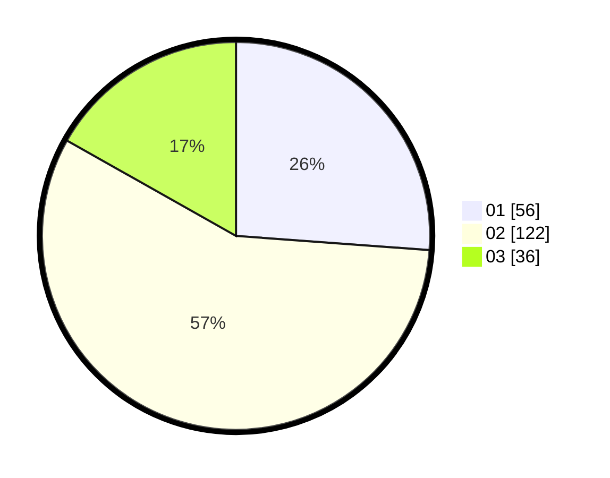

# Hasil

Hasil perolehan suara paslon dapat dilihat pada file paslon-01.txt, paslon-02.txt, dan paslon-03.txt.

Jika tidak ada, artinya data tersebut belum ada pada SIREKAP.

## Perolehan Suara

 * Paslon 01: **56**.
 * Paslon 02: **122**.
 * Paslon 03: **36**.

## Foto C Plano

https://sirekap-obj-formc.kpu.go.id/b4d2/pemilu/ppwp/31/73/01/10/05/3173011005093-20240214-141017--5cbc4751-4d52-46fc-acc8-be5473573fb0.jpg

https://sirekap-obj-formc.kpu.go.id/b4d2/pemilu/ppwp/31/73/01/10/05/3173011005093-20240214-184506--2bb4b4d6-411d-49f3-9587-bc2e4fbf0543.jpg
