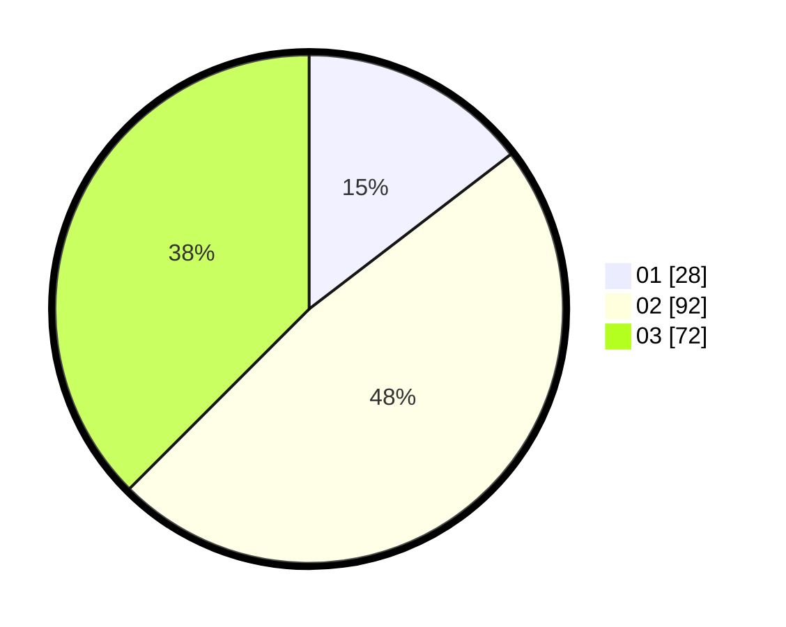

# Hasil

Hasil perolehan suara paslon dapat dilihat pada file paslon-01.txt, paslon-02.txt, dan paslon-03.txt.

Jika tidak ada, artinya data tersebut belum ada pada SIREKAP.

## Perolehan Suara

 * Paslon 01: **28**.
 * Paslon 02: **92**.
 * Paslon 03: **72**.

## Foto C Plano

https://sirekap-obj-formc.kpu.go.id/487e/pemilu/ppwp/31/73/01/10/05/3173011005095-20240214-213026--1dfd4227-7cd9-4f07-a719-c746cbbbc222.jpg

https://sirekap-obj-formc.kpu.go.id/487e/pemilu/ppwp/31/73/01/10/05/3173011005095-20240214-210538--f747a76a-e783-4989-930c-d8f4855f0b00.jpg

https://sirekap-obj-formc.kpu.go.id/487e/pemilu/ppwp/31/73/01/10/05/3173011005095-20240214-213320--2f7d8666-1c3e-46ba-990e-93eeeb3d584a.jpg
