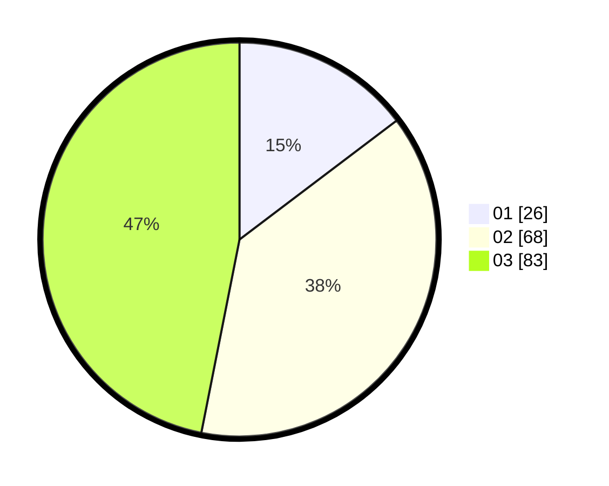

# Hasil

Hasil perolehan suara paslon dapat dilihat pada file paslon-01.txt, paslon-02.txt, dan paslon-03.txt.

Jika tidak ada, artinya data tersebut belum ada pada SIREKAP.

## Perolehan Suara

 * Paslon 01: **26**.
 * Paslon 02: **68**.
 * Paslon 03: **83**.

## Foto C Plano

https://sirekap-obj-formc.kpu.go.id/8420/pemilu/ppwp/31/73/01/10/05/3173011005096-20240214-214558--c9b7f8f5-ba7a-4c66-a447-66b281b39a5f.jpg

https://sirekap-obj-formc.kpu.go.id/8420/pemilu/ppwp/31/73/01/10/05/3173011005096-20240214-212220--5215b2c4-8bbe-47c6-a6e9-909bdeb7b879.jpg

https://sirekap-obj-formc.kpu.go.id/8420/pemilu/ppwp/31/73/01/10/05/3173011005096-20240214-202833--2d00fc1b-a820-4c28-b317-b2f1d4f8d291.jpg
