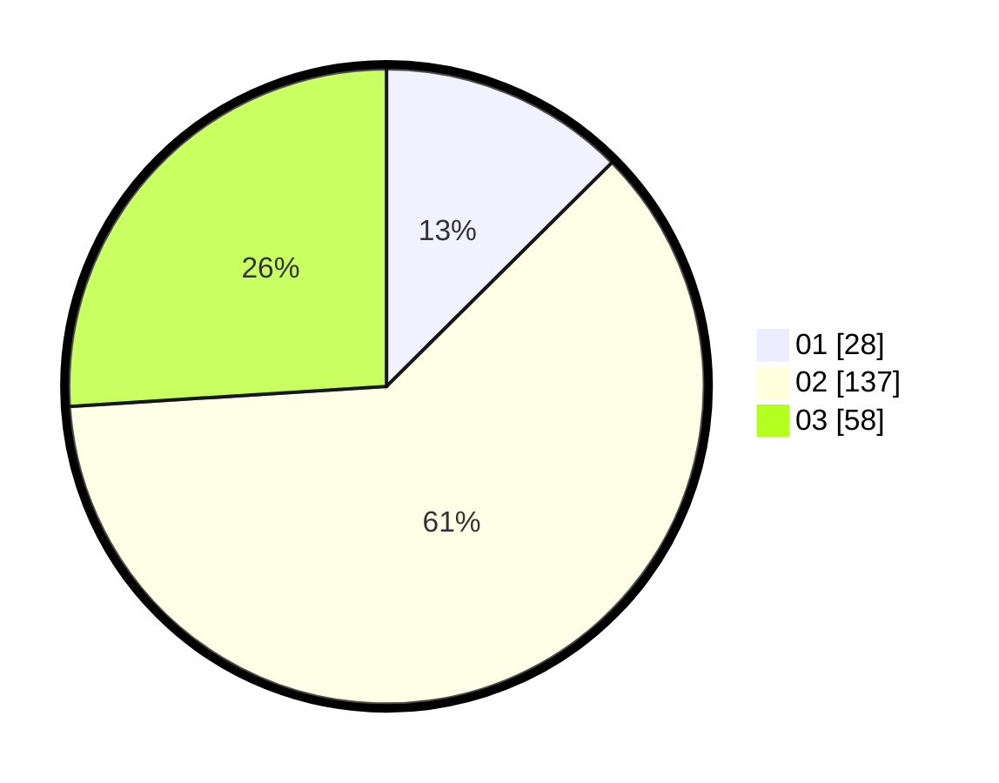

# Hasil

Hasil perolehan suara paslon dapat dilihat pada file paslon-01.txt, paslon-02.txt, dan paslon-03.txt.

Jika tidak ada, artinya data tersebut belum ada pada SIREKAP.

## Perolehan Suara

 * Paslon 01: **28**.
 * Paslon 02: **137**.
 * Paslon 03: **58**.

## Foto C Plano

https://sirekap-obj-formc.kpu.go.id/a958/pemilu/ppwp/31/73/01/10/05/3173011005099-20240214-224336--735cf556-cf8b-43a7-91fe-4c3bfd7b47c2.jpg

https://sirekap-obj-formc.kpu.go.id/a958/pemilu/ppwp/31/73/01/10/05/3173011005099-20240214-224446--ea694a20-dab2-4f02-a7cd-026e4794c0dd.jpg

https://sirekap-obj-formc.kpu.go.id/a958/pemilu/ppwp/31/73/01/10/05/3173011005099-20240214-224527--2807cb67-9597-42fc-be65-2f5acc0bf67b.jpg
