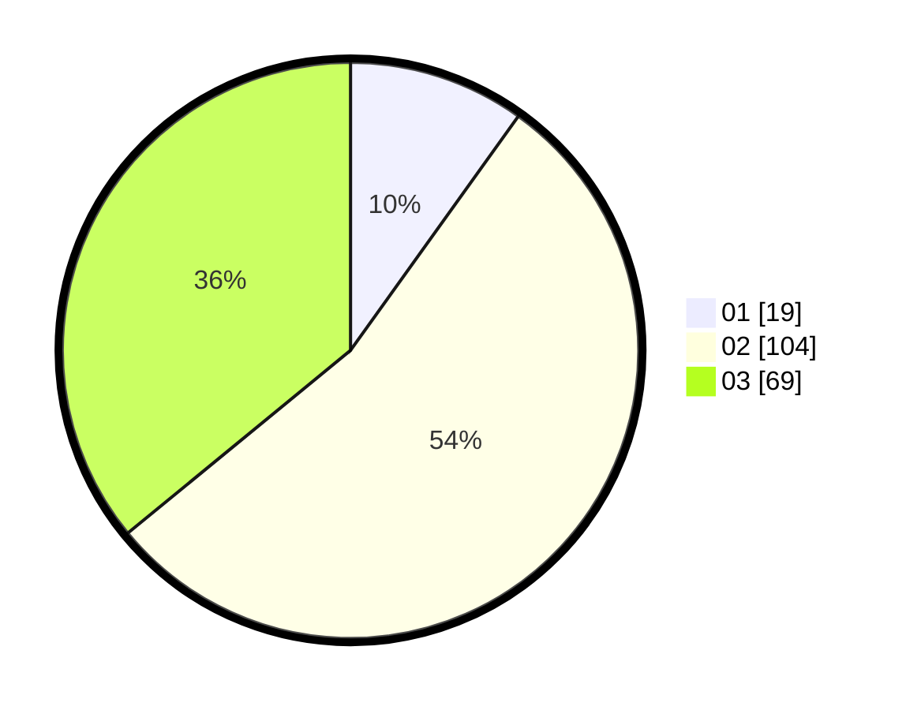

# Hasil

Hasil perolehan suara paslon dapat dilihat pada file paslon-01.txt, paslon-02.txt, dan paslon-03.txt.

Jika tidak ada, artinya data tersebut belum ada pada SIREKAP.

## Perolehan Suara

 * Paslon 01: **19**.
 * Paslon 02: **104**.
 * Paslon 03: **69**.

## Foto C Plano

https://sirekap-obj-formc.kpu.go.id/8c29/pemilu/ppwp/31/73/01/10/05/3173011005104-20240216-140159--4a07b39b-dbf4-4fb0-ba21-16f692f68273.jpg

https://sirekap-obj-formc.kpu.go.id/8c29/pemilu/ppwp/31/73/01/10/05/3173011005104-20240216-140200--558bb9a2-cc19-4d1c-917c-820308fc4722.jpg

https://sirekap-obj-formc.kpu.go.id/8c29/pemilu/ppwp/31/73/01/10/05/3173011005104-20240216-140200--54acce3a-81ef-4241-89d1-8b2e10eefcc3.jpg

## DATA PEMILIH TETAP

Jumlah pemilih dalam DPT: **276**.
 * L: **142**.
 * P: **134**.

## DATA PENGGUNA HAK PILIH

Jumlah pengguna hak pilih dalam DPT: **198**.
 * L: **94**.
 * P: **104**.

Jumlah pengguna hak pilih dalam DPTb: **0**.
 * L: **0**.
 * P: **0**.

Jumlah pengguna hak pilih dalam DPK: **2**.
 * L: **2**.
 * P: **0**.

Jumlah pengguna hak pilih: **200**.
 * L: **96**.
 * P: **104**.

## JUMLAH SUARA SAH DAN TIDAK SAH

JUMLAH SELURUH SUARA SAH: **192**.

JUMLAH SUARA TIDAK SAH: **8**.

JUMLAH SELURUH SUARA SAH DAN SUARA TIDAK SAH: **200**.
