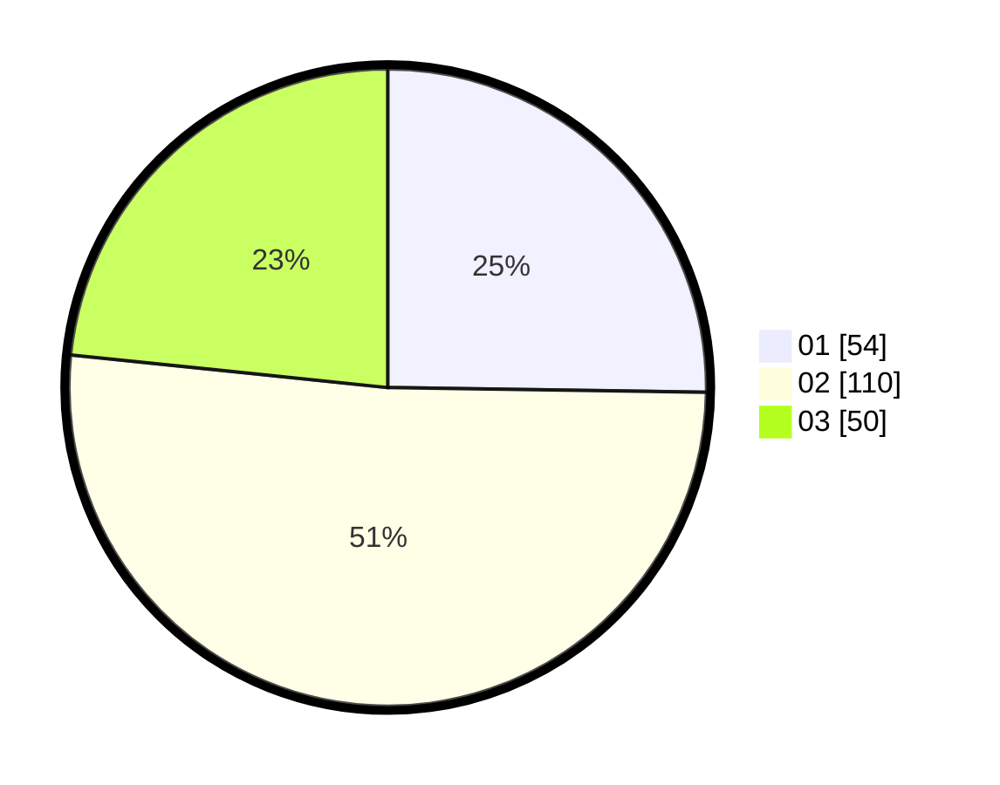

# Hasil

Hasil perolehan suara paslon dapat dilihat pada file paslon-01.txt, paslon-02.txt, dan paslon-03.txt.

Jika tidak ada, artinya data tersebut belum ada pada SIREKAP.

## Perolehan Suara

 * Paslon 01: **54**.
 * Paslon 02: **110**.
 * Paslon 03: **50**.

## Foto C Plano

https://sirekap-obj-formc.kpu.go.id/a75e/pemilu/ppwp/31/73/01/10/05/3173011005105-20240214-204859--ae7eed5e-2416-4062-a926-14d252836be1.jpg

https://sirekap-obj-formc.kpu.go.id/a75e/pemilu/ppwp/31/73/01/10/05/3173011005105-20240214-203717--dce274a4-f051-4ecc-bf16-bbbdfb4ca360.jpg

https://sirekap-obj-formc.kpu.go.id/a75e/pemilu/ppwp/31/73/01/10/05/3173011005105-20240214-203829--9503f4a9-edb6-48a9-98b9-f7f62673cfd7.jpg

## DATA PEMILIH TETAP

Jumlah pemilih dalam DPT: **280**.
 * L: **142**.
 * P: **138**.

## DATA PENGGUNA HAK PILIH

Jumlah pengguna hak pilih dalam DPT: **216**.
 * L: **105**.
 * P: **111**.

Jumlah pengguna hak pilih dalam DPTb: **0**.
 * L: **0**.
 * P: **0**.

Jumlah pengguna hak pilih dalam DPK: **2**.
 * L: **0**.
 * P: **2**.

Jumlah pengguna hak pilih: **218**.
 * L: **105**.
 * P: **113**.

## JUMLAH SUARA SAH DAN TIDAK SAH

JUMLAH SELURUH SUARA SAH: **214**.

JUMLAH SUARA TIDAK SAH: **4**.

JUMLAH SELURUH SUARA SAH DAN SUARA TIDAK SAH: **218**.
