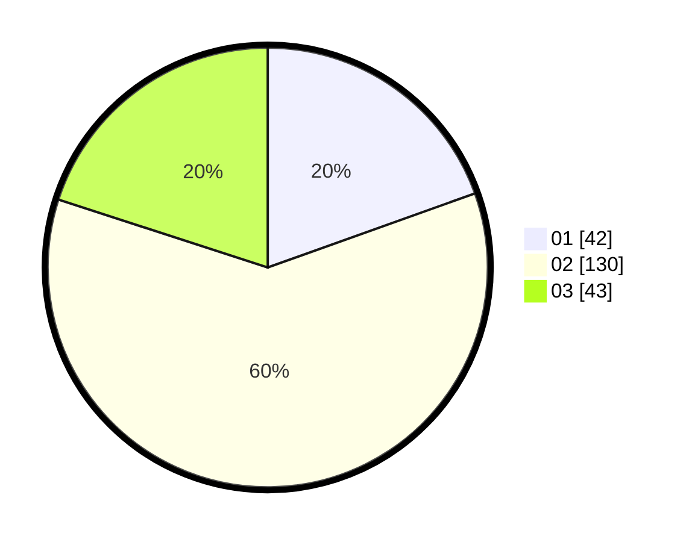

# Hasil

Hasil perolehan suara paslon dapat dilihat pada file paslon-01.txt, paslon-02.txt, dan paslon-03.txt.

Jika tidak ada, artinya data tersebut belum ada pada SIREKAP.

## Perolehan Suara

 * Paslon 01: **42**.
 * Paslon 02: **130**.
 * Paslon 03: **43**.

## Foto C Plano

https://sirekap-obj-formc.kpu.go.id/503f/pemilu/ppwp/31/73/01/10/05/3173011005106-20240214-213407--01db26ad-6dfb-4875-b85c-7e18ece3978e.jpg

https://sirekap-obj-formc.kpu.go.id/503f/pemilu/ppwp/31/73/01/10/05/3173011005106-20240214-213558--51237298-480a-44f2-acb8-3d4d3d005791.jpg

https://sirekap-obj-formc.kpu.go.id/503f/pemilu/ppwp/31/73/01/10/05/3173011005106-20240214-213844--77628a65-83da-4c39-8e13-142153f4b900.jpg
