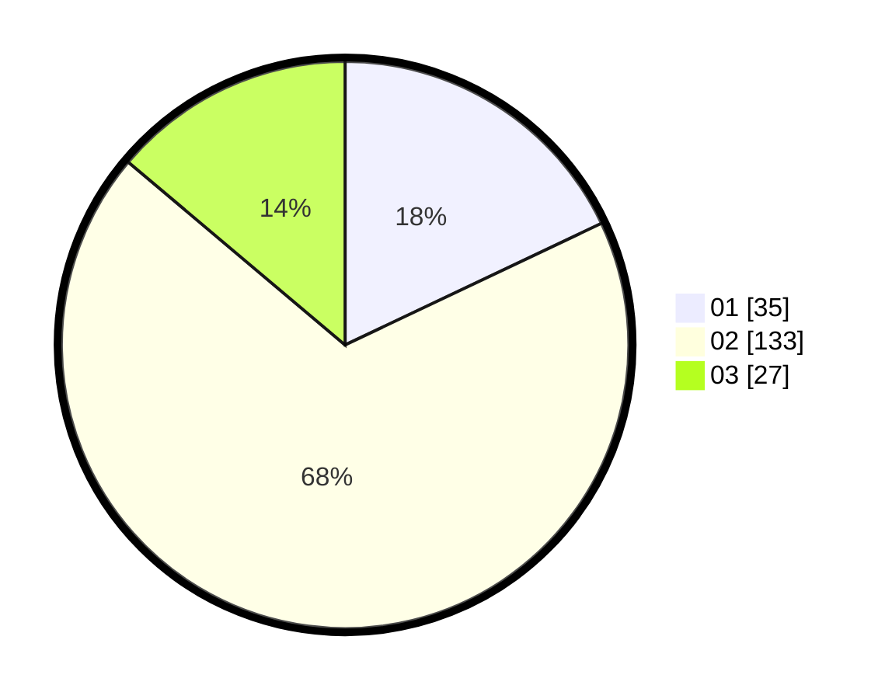

# Hasil

Hasil perolehan suara paslon dapat dilihat pada file paslon-01.txt, paslon-02.txt, dan paslon-03.txt.

Jika tidak ada, artinya data tersebut belum ada pada SIREKAP.

## Perolehan Suara

 * Paslon 01: **35**.
 * Paslon 02: **133**.
 * Paslon 03: **27**.

## Foto C Plano

https://sirekap-obj-formc.kpu.go.id/b1bb/pemilu/ppwp/31/73/01/10/05/3173011005112-20240214-201632--35d1d301-c8af-416a-b5ea-f7da4a6af95c.jpg

https://sirekap-obj-formc.kpu.go.id/b1bb/pemilu/ppwp/31/73/01/10/05/3173011005112-20240214-202052--3e1f57ee-4948-4d1e-8862-b7558810080f.jpg

https://sirekap-obj-formc.kpu.go.id/b1bb/pemilu/ppwp/31/73/01/10/05/3173011005112-20240214-202205--84499441-a12f-4e7a-aab0-bbf17cb8eb27.jpg
