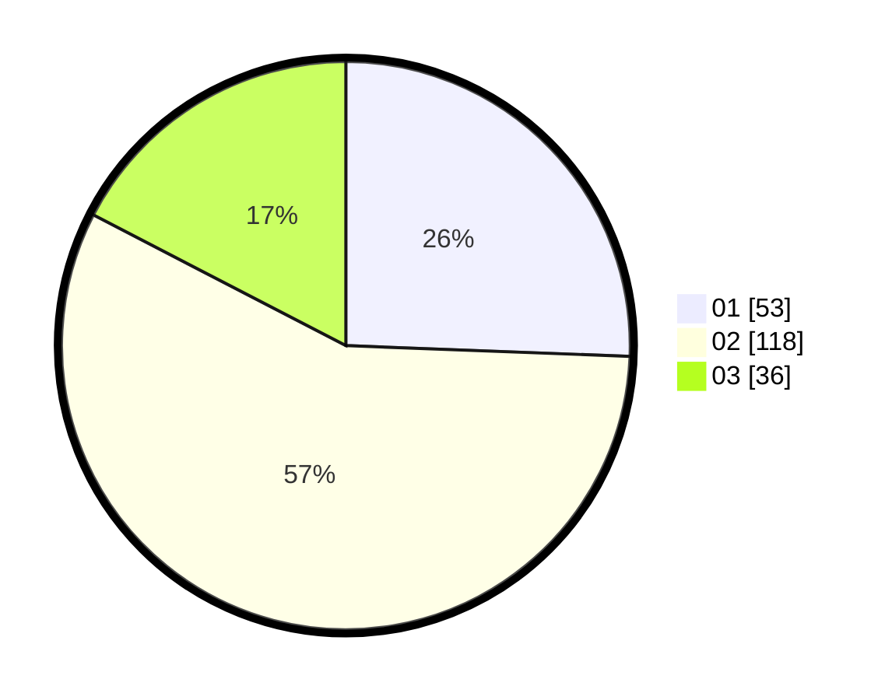

# Hasil

Hasil perolehan suara paslon dapat dilihat pada file paslon-01.txt, paslon-02.txt, dan paslon-03.txt.

Jika tidak ada, artinya data tersebut belum ada pada SIREKAP.

## Perolehan Suara

 * Paslon 01: **53**.
 * Paslon 02: **118**.
 * Paslon 03: **36**.

## Foto C Plano

https://sirekap-obj-formc.kpu.go.id/e755/pemilu/ppwp/31/73/01/10/05/3173011005116-20240214-185857--50d2d8f9-47a0-4a1f-9915-6493500872cc.jpg

https://sirekap-obj-formc.kpu.go.id/e755/pemilu/ppwp/31/73/01/10/05/3173011005116-20240214-185958--1c01ec74-3b96-46fa-b72e-2a07d966eef6.jpg

https://sirekap-obj-formc.kpu.go.id/e755/pemilu/ppwp/31/73/01/10/05/3173011005116-20240214-185737--5aaae406-aa55-456e-b465-ac82fe9d3dca.jpg

## DATA PEMILIH TETAP

Jumlah pemilih dalam DPT: **276**.
 * L: **138**.
 * P: **138**.

## DATA PENGGUNA HAK PILIH

Jumlah pengguna hak pilih dalam DPT: **202**.
 * L: **96**.
 * P: **106**.

Jumlah pengguna hak pilih dalam DPTb: **0**.
 * L: **0**.
 * P: **0**.

Jumlah pengguna hak pilih dalam DPK: **7**.
 * L: **6**.
 * P: **1**.

Jumlah pengguna hak pilih: **209**.
 * L: **102**.
 * P: **107**.

## JUMLAH SUARA SAH DAN TIDAK SAH

JUMLAH SELURUH SUARA SAH: **207**.

JUMLAH SUARA TIDAK SAH: **2**.

JUMLAH SELURUH SUARA SAH DAN SUARA TIDAK SAH: **209**.
