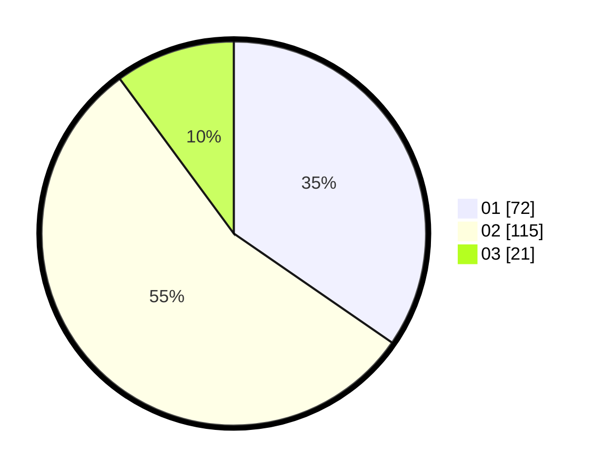

# Hasil

Hasil perolehan suara paslon dapat dilihat pada file paslon-01.txt, paslon-02.txt, dan paslon-03.txt.

Jika tidak ada, artinya data tersebut belum ada pada SIREKAP.

## Perolehan Suara

 * Paslon 01: **72**.
 * Paslon 02: **115**.
 * Paslon 03: **21**.

## Foto C Plano

https://sirekap-obj-formc.kpu.go.id/6645/pemilu/ppwp/31/73/01/10/05/3173011005119-20240216-092612--a6483a02-0d87-408d-b090-cf0d0671a276.jpg

https://sirekap-obj-formc.kpu.go.id/6645/pemilu/ppwp/31/73/01/10/05/3173011005119-20240216-092614--8cae2c38-82a8-42fd-9b71-124f64b225bc.jpg

https://sirekap-obj-formc.kpu.go.id/6645/pemilu/ppwp/31/73/01/10/05/3173011005119-20240216-092613--73b68a93-ec70-41eb-a71b-b3ac2dda80a9.jpg

## DATA PEMILIH TETAP

Jumlah pemilih dalam DPT: **211**.
 * L: **98**.
 * P: **113**.

## DATA PENGGUNA HAK PILIH

Jumlah pengguna hak pilih dalam DPT: **209**.
 * L: **98**.
 * P: **111**.

Jumlah pengguna hak pilih dalam DPTb: **2**.
 * L: **0**.
 * P: **2**.

Jumlah pengguna hak pilih dalam DPK: **0**.
 * L: **0**.
 * P: **0**.

Jumlah pengguna hak pilih: **211**.
 * L: **98**.
 * P: **113**.

## JUMLAH SUARA SAH DAN TIDAK SAH

JUMLAH SELURUH SUARA SAH: **208**.

JUMLAH SUARA TIDAK SAH: **3**.

JUMLAH SELURUH SUARA SAH DAN SUARA TIDAK SAH: **211**.
