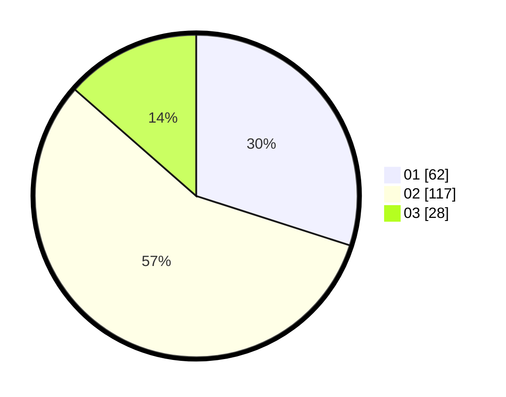

# Hasil

Hasil perolehan suara paslon dapat dilihat pada file paslon-01.txt, paslon-02.txt, dan paslon-03.txt.

Jika tidak ada, artinya data tersebut belum ada pada SIREKAP.

## Perolehan Suara

 * Paslon 01: **62**.
 * Paslon 02: **117**.
 * Paslon 03: **28**.

## Foto C Plano

https://sirekap-obj-formc.kpu.go.id/fc68/pemilu/ppwp/31/73/01/10/05/3173011005123-20240214-185024--56483ed8-7e20-4bde-bfb1-815b3c9b8d94.jpg

https://sirekap-obj-formc.kpu.go.id/fc68/pemilu/ppwp/31/73/01/10/05/3173011005123-20240216-064328--9a16e363-9980-42a4-abc6-649930e97f5c.jpg

https://sirekap-obj-formc.kpu.go.id/fc68/pemilu/ppwp/31/73/01/10/05/3173011005123-20240216-064320--e688870f-2947-4b00-a15f-fdb46c2dbd49.jpg

## DATA PEMILIH TETAP

Jumlah pemilih dalam DPT: **280**.
 * L: **147**.
 * P: **133**.

## DATA PENGGUNA HAK PILIH

Jumlah pengguna hak pilih dalam DPT: **280**.
 * L: **147**.
 * P: **133**.

Jumlah pengguna hak pilih dalam DPTb: **0**.
 * L: **0**.
 * P: **0**.

Jumlah pengguna hak pilih dalam DPK: **2**.
 * L: **1**.
 * P: **1**.

Jumlah pengguna hak pilih: **282**.
 * L: **148**.
 * P: **134**.

## JUMLAH SUARA SAH DAN TIDAK SAH

JUMLAH SELURUH SUARA SAH: **207**.

JUMLAH SUARA TIDAK SAH: **3**.

JUMLAH SELURUH SUARA SAH DAN SUARA TIDAK SAH: **210**.
