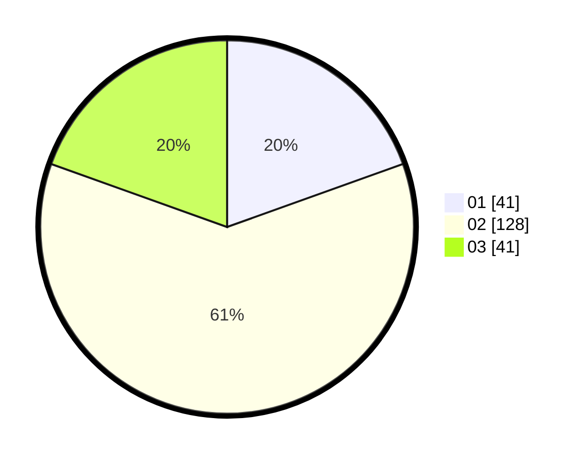

# Hasil

Hasil perolehan suara paslon dapat dilihat pada file paslon-01.txt, paslon-02.txt, dan paslon-03.txt.

Jika tidak ada, artinya data tersebut belum ada pada SIREKAP.

## Perolehan Suara

 * Paslon 01: **41**.
 * Paslon 02: **128**.
 * Paslon 03: **41**.

## Foto C Plano

https://sirekap-obj-formc.kpu.go.id/01c3/pemilu/ppwp/31/73/01/10/05/3173011005126-20240214-175312--e1a91174-d701-435a-a7af-37caf22beb94.jpg

https://sirekap-obj-formc.kpu.go.id/01c3/pemilu/ppwp/31/73/01/10/05/3173011005126-20240214-175449--fc552a9e-9278-436f-b212-64a26fe5cf4a.jpg

https://sirekap-obj-formc.kpu.go.id/01c3/pemilu/ppwp/31/73/01/10/05/3173011005126-20240214-184733--1feddd70-a587-4621-9422-3d1fca443b66.jpg
