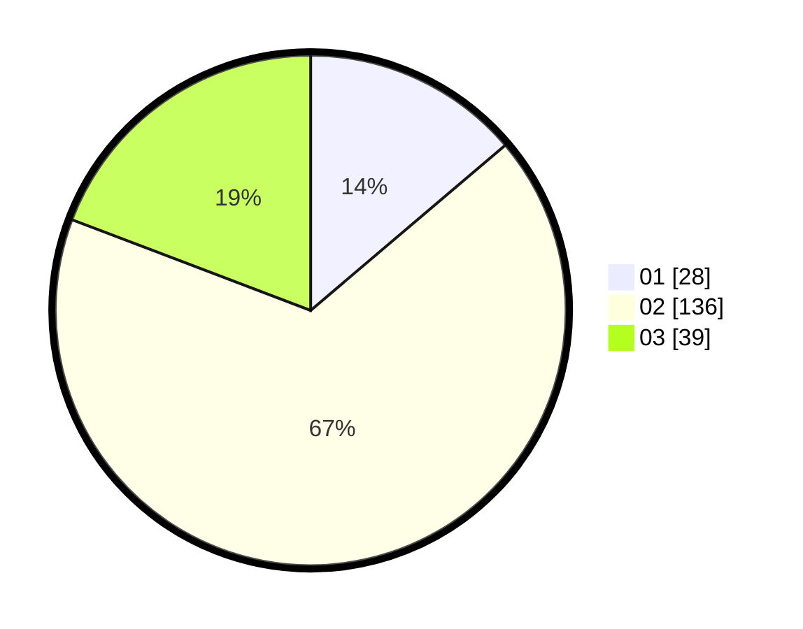

# Hasil

Hasil perolehan suara paslon dapat dilihat pada file paslon-01.txt, paslon-02.txt, dan paslon-03.txt.

Jika tidak ada, artinya data tersebut belum ada pada SIREKAP.

## Perolehan Suara

 * Paslon 01: **28**.
 * Paslon 02: **136**.
 * Paslon 03: **39**.

## Foto C Plano

https://sirekap-obj-formc.kpu.go.id/565b/pemilu/ppwp/31/73/01/10/05/3173011005127-20240214-155200--0738ef94-2f5d-4567-9e4d-e3a589342db9.jpg

https://sirekap-obj-formc.kpu.go.id/565b/pemilu/ppwp/31/73/01/10/05/3173011005127-20240214-155157--2033c21b-a44b-4186-b16b-2e0b7fc6f254.jpg

https://sirekap-obj-formc.kpu.go.id/565b/pemilu/ppwp/31/73/01/10/05/3173011005127-20240214-155204--a29bae7d-8f8f-49ff-88f9-f41d74592f6a.jpg

## DATA PEMILIH TETAP

Jumlah pemilih dalam DPT: **278**.
 * L: **143**.
 * P: **135**.

## DATA PENGGUNA HAK PILIH

Jumlah pengguna hak pilih dalam DPT: **203**.
 * L: **98**.
 * P: **105**.

Jumlah pengguna hak pilih dalam DPTb: **1**.
 * L: **1**.
 * P: **0**.

Jumlah pengguna hak pilih dalam DPK: **2**.
 * L: **0**.
 * P: **2**.

Jumlah pengguna hak pilih: **206**.
 * L: **99**.
 * P: **107**.

## JUMLAH SUARA SAH DAN TIDAK SAH

JUMLAH SELURUH SUARA SAH: **203**.

JUMLAH SUARA TIDAK SAH: **3**.

JUMLAH SELURUH SUARA SAH DAN SUARA TIDAK SAH: **206**.
