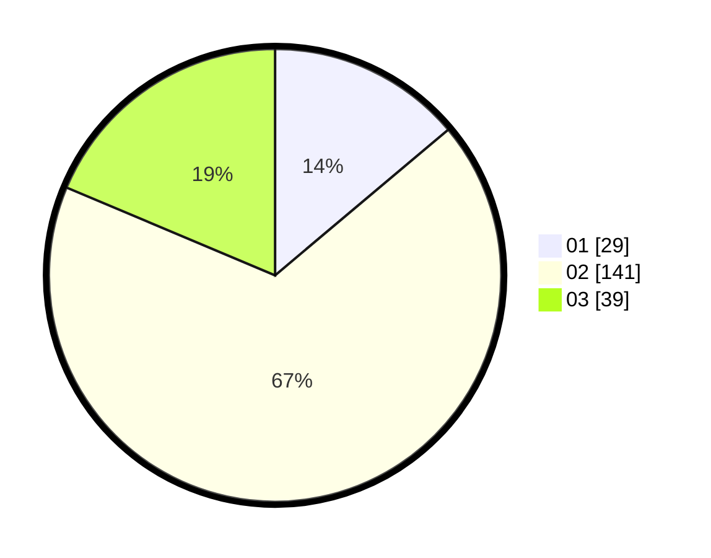

# Hasil

Hasil perolehan suara paslon dapat dilihat pada file paslon-01.txt, paslon-02.txt, dan paslon-03.txt.

Jika tidak ada, artinya data tersebut belum ada pada SIREKAP.

## Perolehan Suara

 * Paslon 01: **29**.
 * Paslon 02: **141**.
 * Paslon 03: **39**.

## Foto C Plano

https://sirekap-obj-formc.kpu.go.id/cddb/pemilu/ppwp/31/73/01/10/05/3173011005130-20240215-204731--2615122e-b468-43a3-93b6-8247c11ee988.jpg

https://sirekap-obj-formc.kpu.go.id/cddb/pemilu/ppwp/31/73/01/10/05/3173011005130-20240215-204735--238e27aa-d3ce-48f3-b99a-3a0bd46ec02d.jpg

https://sirekap-obj-formc.kpu.go.id/cddb/pemilu/ppwp/31/73/01/10/05/3173011005130-20240215-204733--ad2b79d0-b785-4232-96b8-4e38430a8815.jpg

## DATA PEMILIH TETAP

Jumlah pemilih dalam DPT: **277**.
 * L: **140**.
 * P: **137**.

## DATA PENGGUNA HAK PILIH

Jumlah pengguna hak pilih dalam DPT: **211**.
 * L: **107**.
 * P: **104**.

Jumlah pengguna hak pilih dalam DPTb: **0**.
 * L: **0**.
 * P: **0**.

Jumlah pengguna hak pilih dalam DPK: **0**.
 * L: **0**.
 * P: **0**.

Jumlah pengguna hak pilih: **211**.
 * L: **107**.
 * P: **104**.

## JUMLAH SUARA SAH DAN TIDAK SAH

JUMLAH SELURUH SUARA SAH: **209**.

JUMLAH SUARA TIDAK SAH: **2**.

JUMLAH SELURUH SUARA SAH DAN SUARA TIDAK SAH: **211**.
