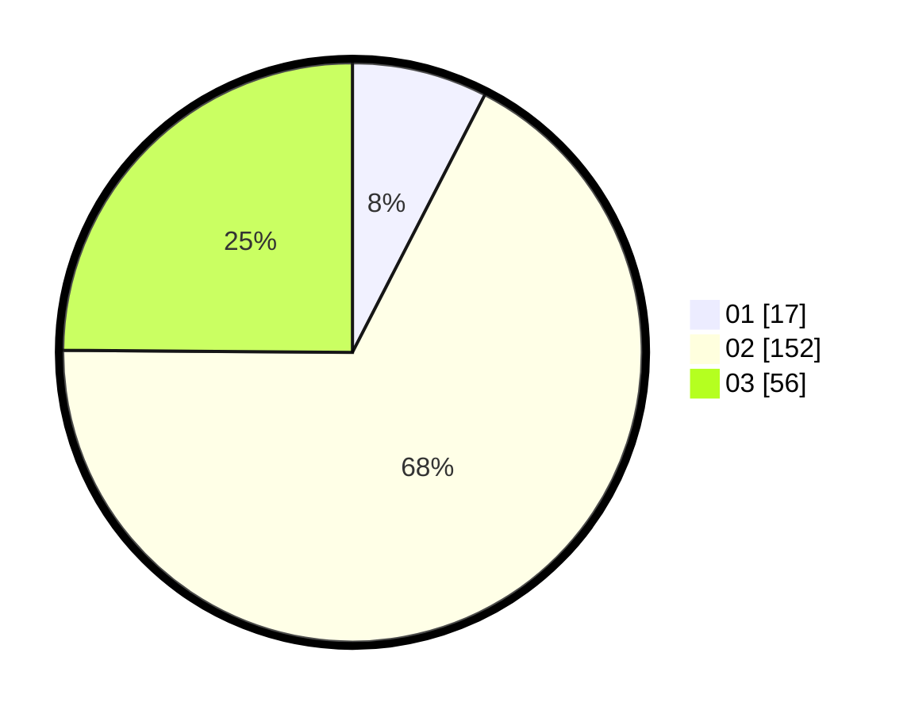

# Hasil

Hasil perolehan suara paslon dapat dilihat pada file paslon-01.txt, paslon-02.txt, dan paslon-03.txt.

Jika tidak ada, artinya data tersebut belum ada pada SIREKAP.

## Perolehan Suara

 * Paslon 01: **17**.
 * Paslon 02: **152**.
 * Paslon 03: **56**.

## Foto C Plano

https://sirekap-obj-formc.kpu.go.id/e874/pemilu/ppwp/31/73/01/10/05/3173011005132-20240216-090934--a99c2342-1760-4a4b-85a1-ee164523b21f.jpg

https://sirekap-obj-formc.kpu.go.id/e874/pemilu/ppwp/31/73/01/10/05/3173011005132-20240216-091900--1ae6fa51-e2c6-4823-9171-4b7318553bec.jpg

https://sirekap-obj-formc.kpu.go.id/e874/pemilu/ppwp/31/73/01/10/05/3173011005132-20240216-090935--94c77379-cfd2-407f-9cfe-56d208e9750e.jpg

## DATA PEMILIH TETAP

Jumlah pemilih dalam DPT: **277**.
 * L: **140**.
 * P: **137**.

## DATA PENGGUNA HAK PILIH

Jumlah pengguna hak pilih dalam DPT: **229**.
 * L: **110**.
 * P: **119**.

Jumlah pengguna hak pilih dalam DPTb: **0**.
 * L: **0**.
 * P: **0**.

Jumlah pengguna hak pilih dalam DPK: **0**.
 * L: **0**.
 * P: **0**.

Jumlah pengguna hak pilih: **229**.
 * L: **110**.
 * P: **119**.

## JUMLAH SUARA SAH DAN TIDAK SAH

JUMLAH SELURUH SUARA SAH: **225**.

JUMLAH SUARA TIDAK SAH: **4**.

JUMLAH SELURUH SUARA SAH DAN SUARA TIDAK SAH: **229**.
