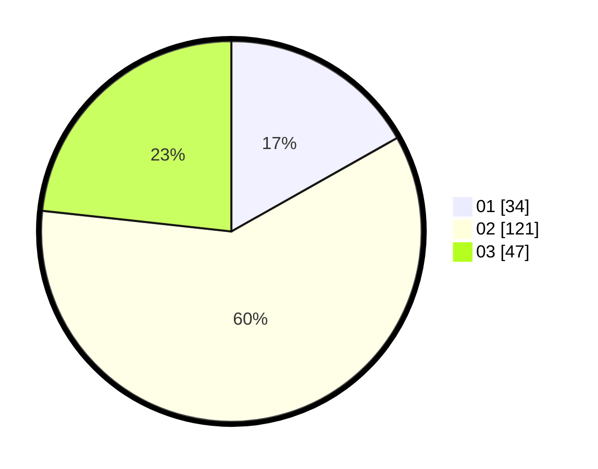

# Hasil

Hasil perolehan suara paslon dapat dilihat pada file paslon-01.txt, paslon-02.txt, dan paslon-03.txt.

Jika tidak ada, artinya data tersebut belum ada pada SIREKAP.

## Perolehan Suara

 * Paslon 01: **34**.
 * Paslon 02: **121**.
 * Paslon 03: **47**.

## Foto C Plano

https://sirekap-obj-formc.kpu.go.id/6422/pemilu/ppwp/31/73/01/10/05/3173011005138-20240214-185708--bad4f077-be80-4f8b-9d2e-ac4a665435f4.jpg

https://sirekap-obj-formc.kpu.go.id/6422/pemilu/ppwp/31/73/01/10/05/3173011005138-20240214-190309--25aae61b-64ed-4fcd-982e-f7daeda89535.jpg

https://sirekap-obj-formc.kpu.go.id/6422/pemilu/ppwp/31/73/01/10/05/3173011005138-20240214-185625--5ccd6fae-9d83-4c39-8f36-770ac795d30e.jpg

## DATA PEMILIH TETAP

Jumlah pemilih dalam DPT: **266**.
 * L: **134**.
 * P: **132**.

## DATA PENGGUNA HAK PILIH

Jumlah pengguna hak pilih dalam DPT: **201**.
 * L: **101**.
 * P: **100**.

Jumlah pengguna hak pilih dalam DPTb: **0**.
 * L: **0**.
 * P: **0**.

Jumlah pengguna hak pilih dalam DPK: **1**.
 * L: **1**.
 * P: **1**.

Jumlah pengguna hak pilih: **203**.
 * L: **102**.
 * P: **101**.

## JUMLAH SUARA SAH DAN TIDAK SAH

JUMLAH SELURUH SUARA SAH: **202**.

JUMLAH SUARA TIDAK SAH: **1**.

JUMLAH SELURUH SUARA SAH DAN SUARA TIDAK SAH: **203**.
