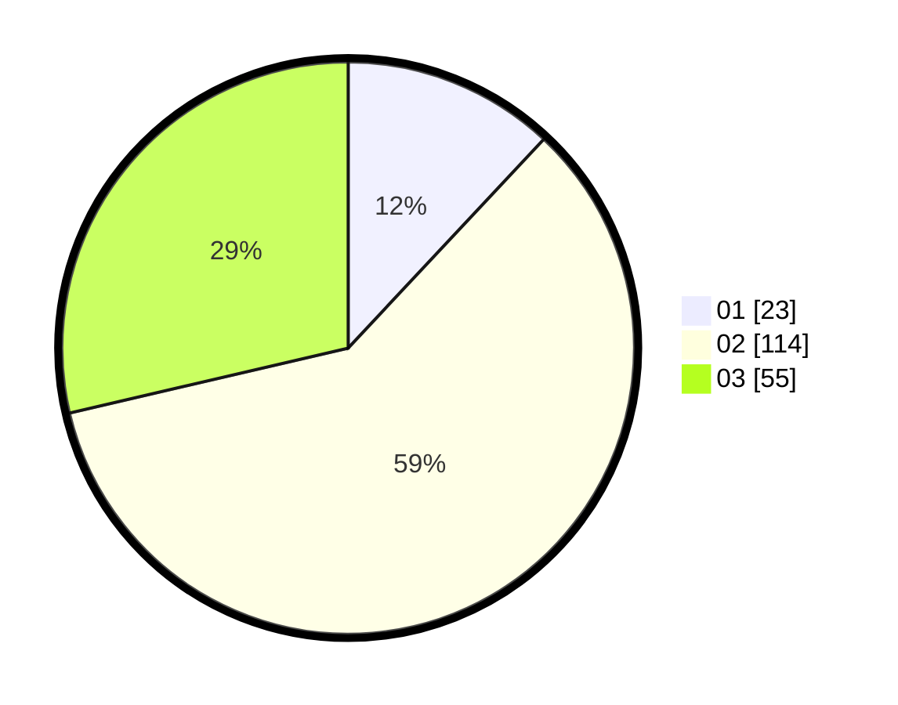

# Hasil

Hasil perolehan suara paslon dapat dilihat pada file paslon-01.txt, paslon-02.txt, dan paslon-03.txt.

Jika tidak ada, artinya data tersebut belum ada pada SIREKAP.

## Perolehan Suara

 * Paslon 01: **23**.
 * Paslon 02: **114**.
 * Paslon 03: **55**.

## Foto C Plano

https://sirekap-obj-formc.kpu.go.id/da54/pemilu/ppwp/31/73/01/10/05/3173011005139-20240214-221748--abcbab9a-f8fa-4301-8f20-8155fbcba525.jpg

https://sirekap-obj-formc.kpu.go.id/da54/pemilu/ppwp/31/73/01/10/05/3173011005139-20240214-224517--a07cce75-1ab9-47a5-b283-6a55879b8f54.jpg

https://sirekap-obj-formc.kpu.go.id/da54/pemilu/ppwp/31/73/01/10/05/3173011005139-20240214-224635--01df9a02-1098-4044-80b5-aa6febde2d5d.jpg
