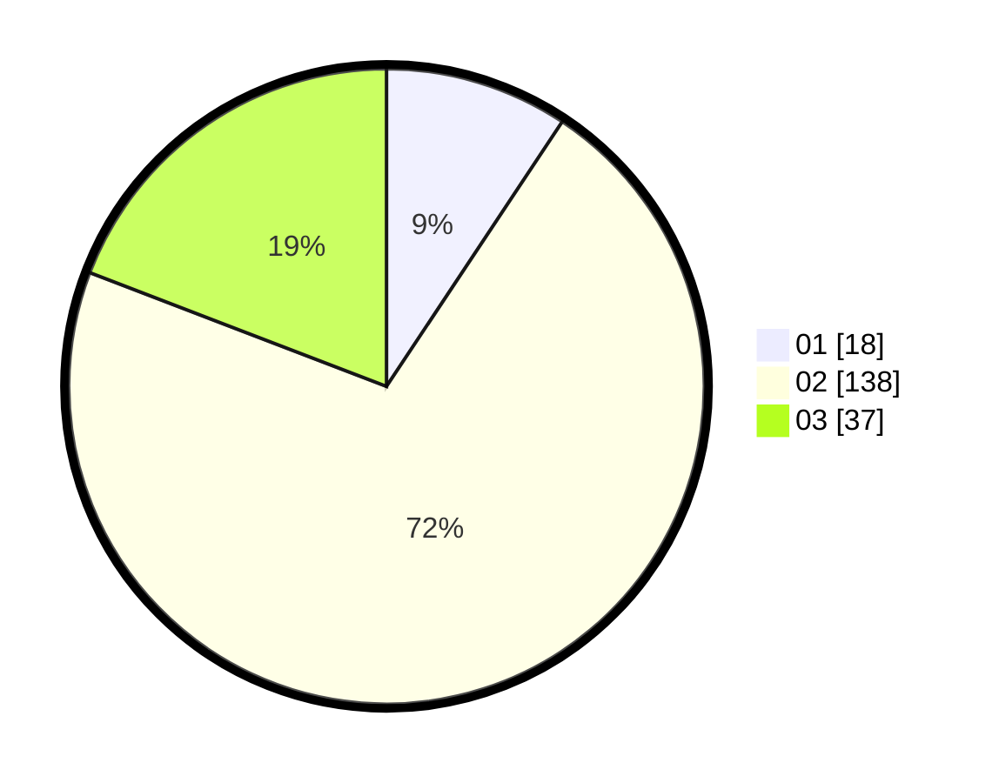

# Hasil

Hasil perolehan suara paslon dapat dilihat pada file paslon-01.txt, paslon-02.txt, dan paslon-03.txt.

Jika tidak ada, artinya data tersebut belum ada pada SIREKAP.

## Perolehan Suara

 * Paslon 01: **18**.
 * Paslon 02: **138**.
 * Paslon 03: **37**.

## Foto C Plano

https://sirekap-obj-formc.kpu.go.id/8ea9/pemilu/ppwp/31/73/01/10/05/3173011005142-20240214-225156--73b979e4-008f-4e82-83ed-d290eea6ea36.jpg

https://sirekap-obj-formc.kpu.go.id/8ea9/pemilu/ppwp/31/73/01/10/05/3173011005142-20240216-044805--ac2858ff-4147-4633-99e7-df58f6daa468.jpg

https://sirekap-obj-formc.kpu.go.id/8ea9/pemilu/ppwp/31/73/01/10/05/3173011005142-20240216-044804--f22f0769-1f2e-4fd9-95ce-4a128b8311d0.jpg
