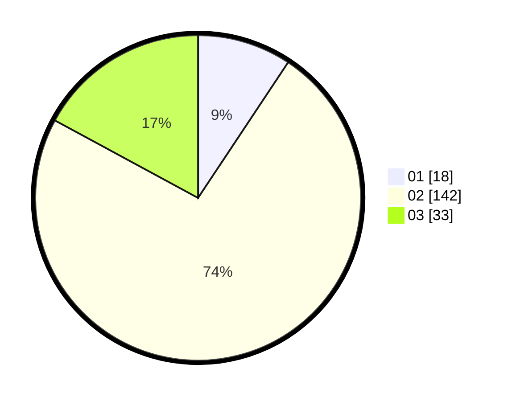

# Hasil

Hasil perolehan suara paslon dapat dilihat pada file paslon-01.txt, paslon-02.txt, dan paslon-03.txt.

Jika tidak ada, artinya data tersebut belum ada pada SIREKAP.

## Perolehan Suara

 * Paslon 01: **18**.
 * Paslon 02: **142**.
 * Paslon 03: **33**.

## Foto C Plano

https://sirekap-obj-formc.kpu.go.id/dd14/pemilu/ppwp/31/73/01/10/05/3173011005143-20240216-081538--9d5e3bc2-c260-4fe0-a557-7e86bd4455cd.jpg

https://sirekap-obj-formc.kpu.go.id/dd14/pemilu/ppwp/31/73/01/10/05/3173011005143-20240216-081544--de9d4b19-f104-4f4e-9098-66c54912f956.jpg

https://sirekap-obj-formc.kpu.go.id/dd14/pemilu/ppwp/31/73/01/10/05/3173011005143-20240216-081541--e2eab6f7-dafb-4381-9a3e-1cab80a40bff.jpg

## DATA PEMILIH TETAP

Jumlah pemilih dalam DPT: **266**.
 * L: **146**.
 * P: **120**.

## DATA PENGGUNA HAK PILIH

Jumlah pengguna hak pilih dalam DPT: **195**.
 * L: **105**.
 * P: **90**.

Jumlah pengguna hak pilih dalam DPTb: **0**.
 * L: **0**.
 * P: **0**.

Jumlah pengguna hak pilih dalam DPK: **3**.
 * L: **2**.
 * P: **1**.

Jumlah pengguna hak pilih: **198**.
 * L: **107**.
 * P: **91**.

## JUMLAH SUARA SAH DAN TIDAK SAH

JUMLAH SELURUH SUARA SAH: **193**.

JUMLAH SUARA TIDAK SAH: **5**.

JUMLAH SELURUH SUARA SAH DAN SUARA TIDAK SAH: **198**.
