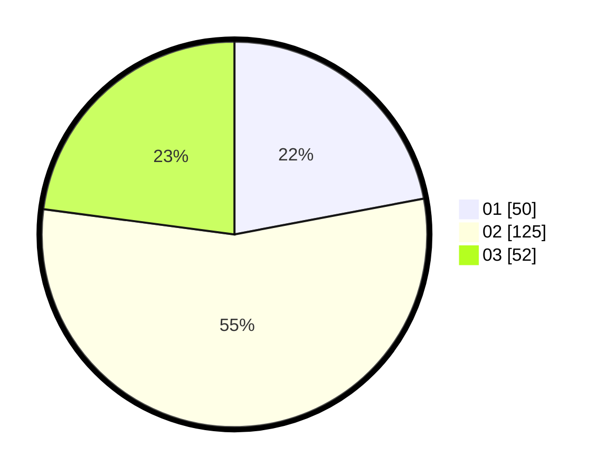

# Hasil

Hasil perolehan suara paslon dapat dilihat pada file paslon-01.txt, paslon-02.txt, dan paslon-03.txt.

Jika tidak ada, artinya data tersebut belum ada pada SIREKAP.

## Perolehan Suara

 * Paslon 01: **50**.
 * Paslon 02: **125**.
 * Paslon 03: **52**.

## Foto C Plano

https://sirekap-obj-formc.kpu.go.id/9d14/pemilu/ppwp/31/73/01/10/05/3173011005144-20240214-222421--57056750-0874-404b-9742-8182c2956b50.jpg

https://sirekap-obj-formc.kpu.go.id/9d14/pemilu/ppwp/31/73/01/10/05/3173011005144-20240214-222518--fe82fb3c-fbd9-4513-82f3-cfd39c6f1038.jpg

https://sirekap-obj-formc.kpu.go.id/9d14/pemilu/ppwp/31/73/01/10/05/3173011005144-20240214-222558--121e945b-6cd5-426e-b298-a0a27b9dc776.jpg

## DATA PEMILIH TETAP

Jumlah pemilih dalam DPT: **280**.
 * L: **135**.
 * P: **145**.

## DATA PENGGUNA HAK PILIH

Jumlah pengguna hak pilih dalam DPT: **220**.
 * L: **103**.
 * P: **117**.

Jumlah pengguna hak pilih dalam DPTb: **1**.
 * L: **0**.
 * P: **1**.

Jumlah pengguna hak pilih dalam DPK: **5**.
 * L: **4**.
 * P: **1**.

Jumlah pengguna hak pilih: **226**.
 * L: **107**.
 * P: **119**.

## JUMLAH SUARA SAH DAN TIDAK SAH

JUMLAH SELURUH SUARA SAH: **227**.

JUMLAH SUARA TIDAK SAH: **0**.

JUMLAH SELURUH SUARA SAH DAN SUARA TIDAK SAH: **227**.
