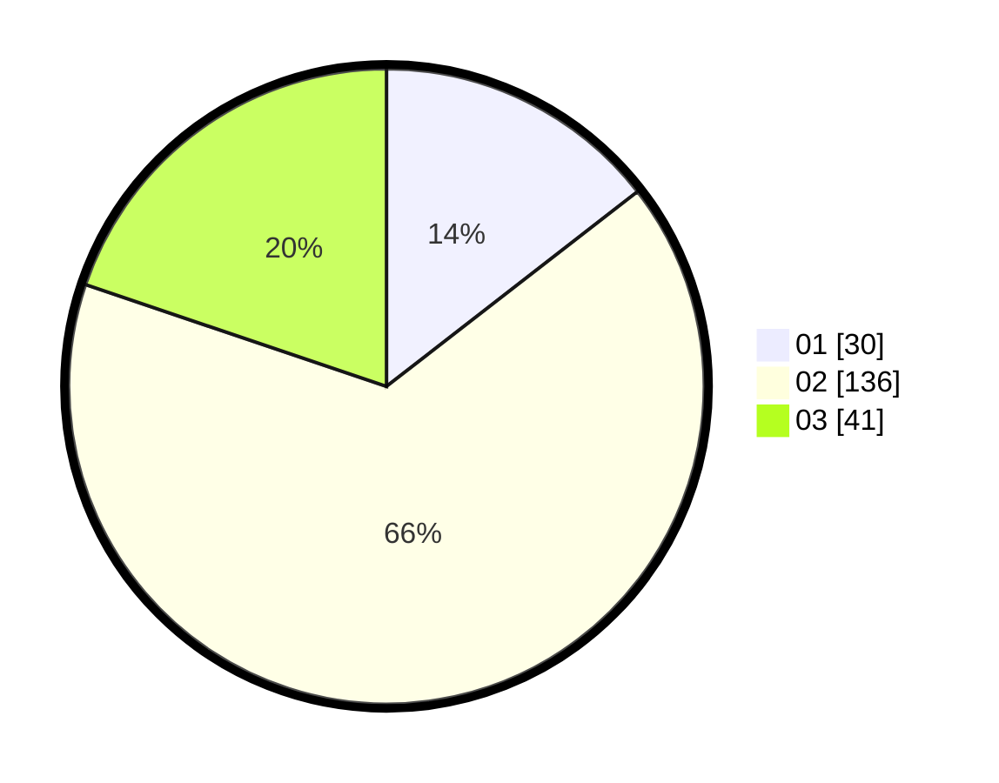

# Hasil

Hasil perolehan suara paslon dapat dilihat pada file paslon-01.txt, paslon-02.txt, dan paslon-03.txt.

Jika tidak ada, artinya data tersebut belum ada pada SIREKAP.

## Perolehan Suara

 * Paslon 01: **30**.
 * Paslon 02: **136**.
 * Paslon 03: **41**.

## Foto C Plano

https://sirekap-obj-formc.kpu.go.id/989b/pemilu/ppwp/31/73/01/10/05/3173011005145-20240214-160106--2e332037-87a2-4129-96c5-ed7ed5330a96.jpg

https://sirekap-obj-formc.kpu.go.id/989b/pemilu/ppwp/31/73/01/10/05/3173011005145-20240214-231937--350a00f2-31f9-46ee-b5c6-f709a209e305.jpg

https://sirekap-obj-formc.kpu.go.id/989b/pemilu/ppwp/31/73/01/10/05/3173011005145-20240214-232007--26f82c46-a98a-4abe-8ee3-1f801ff45682.jpg
