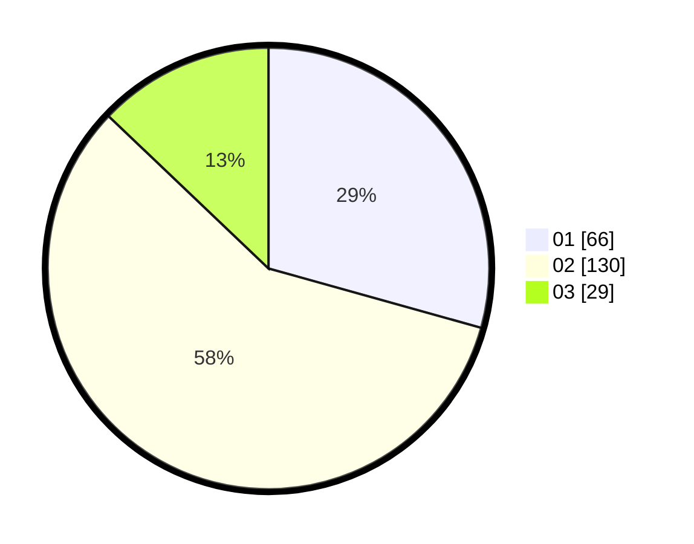

# Hasil

Hasil perolehan suara paslon dapat dilihat pada file paslon-01.txt, paslon-02.txt, dan paslon-03.txt.

Jika tidak ada, artinya data tersebut belum ada pada SIREKAP.

## Perolehan Suara

 * Paslon 01: **66**.
 * Paslon 02: **130**.
 * Paslon 03: **29**.

## Foto C Plano

https://sirekap-obj-formc.kpu.go.id/764b/pemilu/ppwp/31/73/01/10/05/3173011005146-20240214-233312--25d2a87b-44a6-4edb-a2ba-665449452d4b.jpg

https://sirekap-obj-formc.kpu.go.id/764b/pemilu/ppwp/31/73/01/10/05/3173011005146-20240214-232845--5cb0e3d8-3ad0-4404-9e4c-35ccf7c6ad78.jpg

https://sirekap-obj-formc.kpu.go.id/764b/pemilu/ppwp/31/73/01/10/05/3173011005146-20240214-232948--4d0eb319-102d-44a9-a64e-55215310ce82.jpg
