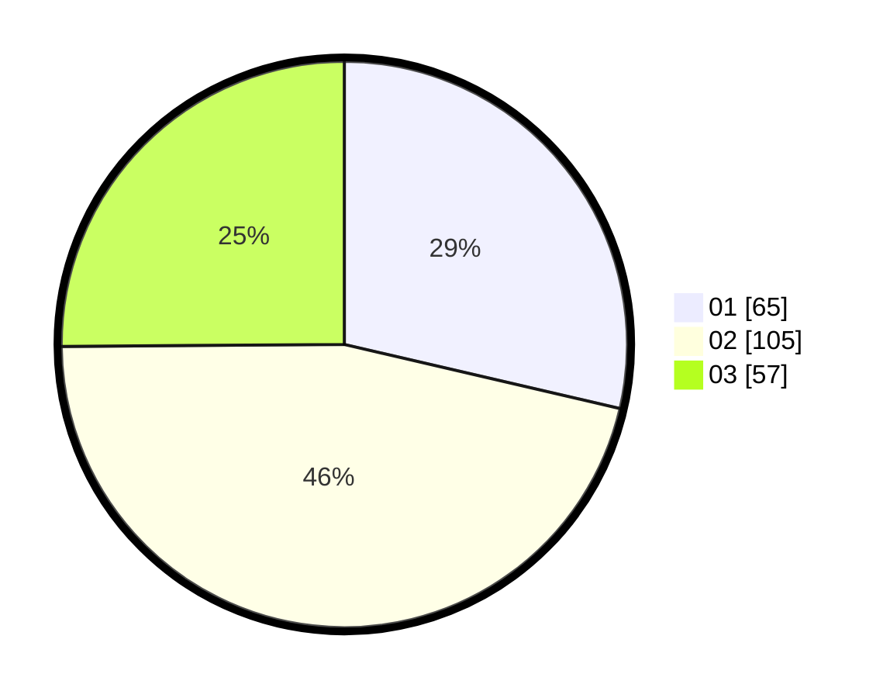

# Hasil

Hasil perolehan suara paslon dapat dilihat pada file paslon-01.txt, paslon-02.txt, dan paslon-03.txt.

Jika tidak ada, artinya data tersebut belum ada pada SIREKAP.

## Perolehan Suara

 * Paslon 01: **65**.
 * Paslon 02: **105**.
 * Paslon 03: **57**.

## Foto C Plano

https://sirekap-obj-formc.kpu.go.id/da6e/pemilu/ppwp/31/73/01/10/05/3173011005148-20240216-142532--58b879cf-9016-4f4e-918a-023e8155023f.jpg

https://sirekap-obj-formc.kpu.go.id/da6e/pemilu/ppwp/31/73/01/10/05/3173011005148-20240216-142533--46dc9f5e-5a80-47d6-824e-24142aeac8d2.jpg

https://sirekap-obj-formc.kpu.go.id/da6e/pemilu/ppwp/31/73/01/10/05/3173011005148-20240216-142532--02ac7eaa-88a4-4ace-be8c-de198f078129.jpg

## DATA PEMILIH TETAP

Jumlah pemilih dalam DPT: **278**.
 * L: **137**.
 * P: **141**.

## DATA PENGGUNA HAK PILIH

Jumlah pengguna hak pilih dalam DPT: **226**.
 * L: **112**.
 * P: **114**.

Jumlah pengguna hak pilih dalam DPTb: **1**.
 * L: **0**.
 * P: **1**.

Jumlah pengguna hak pilih dalam DPK: **3**.
 * L: **2**.
 * P: **1**.

Jumlah pengguna hak pilih: **230**.
 * L: **114**.
 * P: **116**.

## JUMLAH SUARA SAH DAN TIDAK SAH

JUMLAH SELURUH SUARA SAH: **227**.

JUMLAH SUARA TIDAK SAH: **3**.

JUMLAH SELURUH SUARA SAH DAN SUARA TIDAK SAH: **230**.
