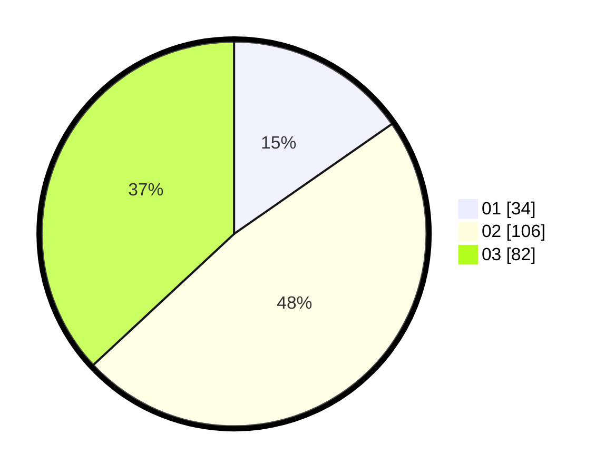

# Hasil

Hasil perolehan suara paslon dapat dilihat pada file paslon-01.txt, paslon-02.txt, dan paslon-03.txt.

Jika tidak ada, artinya data tersebut belum ada pada SIREKAP.

## Perolehan Suara

 * Paslon 01: **34**.
 * Paslon 02: **106**.
 * Paslon 03: **82**.

## Foto C Plano

https://sirekap-obj-formc.kpu.go.id/7892/pemilu/ppwp/31/73/01/10/05/3173011005159-20240214-184453--41694fdc-a183-4514-abbf-a46ab38b2c5c.jpg

https://sirekap-obj-formc.kpu.go.id/7892/pemilu/ppwp/31/73/01/10/05/3173011005159-20240214-184502--ca13757f-4e8e-41d7-9ff1-21f7e27b4598.jpg

https://sirekap-obj-formc.kpu.go.id/7892/pemilu/ppwp/31/73/01/10/05/3173011005159-20240214-184509--b5978be2-0ee4-4942-a7f5-653e64dce40e.jpg

## DATA PEMILIH TETAP

Jumlah pemilih dalam DPT: **275**.
 * L: **130**.
 * P: **145**.

## DATA PENGGUNA HAK PILIH

Jumlah pengguna hak pilih dalam DPT: **215**.
 * L: **106**.
 * P: **109**.

Jumlah pengguna hak pilih dalam DPTb: **3**.
 * L: **1**.
 * P: **2**.

Jumlah pengguna hak pilih dalam DPK: **8**.
 * L: **5**.
 * P: **3**.

Jumlah pengguna hak pilih: **266**.
 * L: **112**.
 * P: **114**.

## JUMLAH SUARA SAH DAN TIDAK SAH

JUMLAH SELURUH SUARA SAH: **222**.

JUMLAH SUARA TIDAK SAH: **4**.

JUMLAH SELURUH SUARA SAH DAN SUARA TIDAK SAH: **226**.
