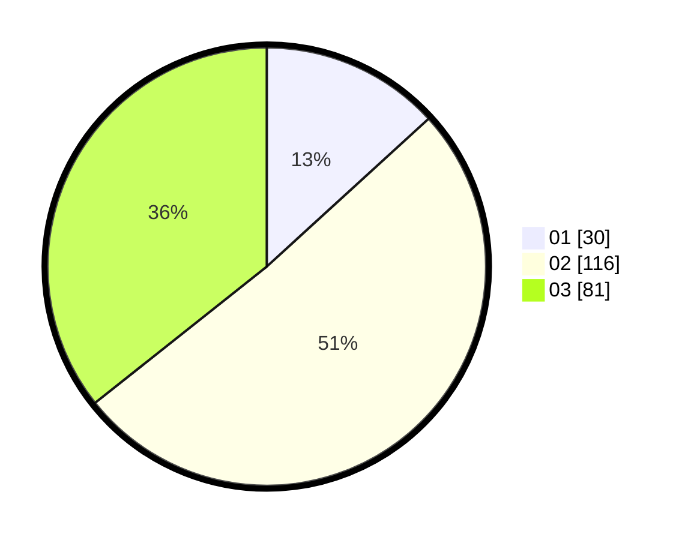

# Hasil

Hasil perolehan suara paslon dapat dilihat pada file paslon-01.txt, paslon-02.txt, dan paslon-03.txt.

Jika tidak ada, artinya data tersebut belum ada pada SIREKAP.

## Perolehan Suara

 * Paslon 01: **30**.
 * Paslon 02: **116**.
 * Paslon 03: **81**.

## Foto C Plano

https://sirekap-obj-formc.kpu.go.id/93d9/pemilu/ppwp/31/73/01/10/05/3173011005162-20240216-042825--ec2b1566-6f3d-4431-aa51-934cc42b3970.jpg

https://sirekap-obj-formc.kpu.go.id/93d9/pemilu/ppwp/31/73/01/10/05/3173011005162-20240216-042827--21caeb47-ea5f-4803-9d09-aa664392fab2.jpg

https://sirekap-obj-formc.kpu.go.id/93d9/pemilu/ppwp/31/73/01/10/05/3173011005162-20240216-042200--ec38ad45-a2c4-4918-aaed-1b51a7402fb5.jpg

## DATA PEMILIH TETAP

Jumlah pemilih dalam DPT: **281**.
 * L: **135**.
 * P: **146**.

## DATA PENGGUNA HAK PILIH

Jumlah pengguna hak pilih dalam DPT: **197**.
 * L: **98**.
 * P: **99**.

Jumlah pengguna hak pilih dalam DPTb: **7**.
 * L: **1**.
 * P: **6**.

Jumlah pengguna hak pilih dalam DPK: **23**.
 * L: **9**.
 * P: **14**.

Jumlah pengguna hak pilih: **227**.
 * L: **108**.
 * P: **119**.

## JUMLAH SUARA SAH DAN TIDAK SAH

JUMLAH SELURUH SUARA SAH: **227**.

JUMLAH SUARA TIDAK SAH: **1**.

JUMLAH SELURUH SUARA SAH DAN SUARA TIDAK SAH: **228**.
