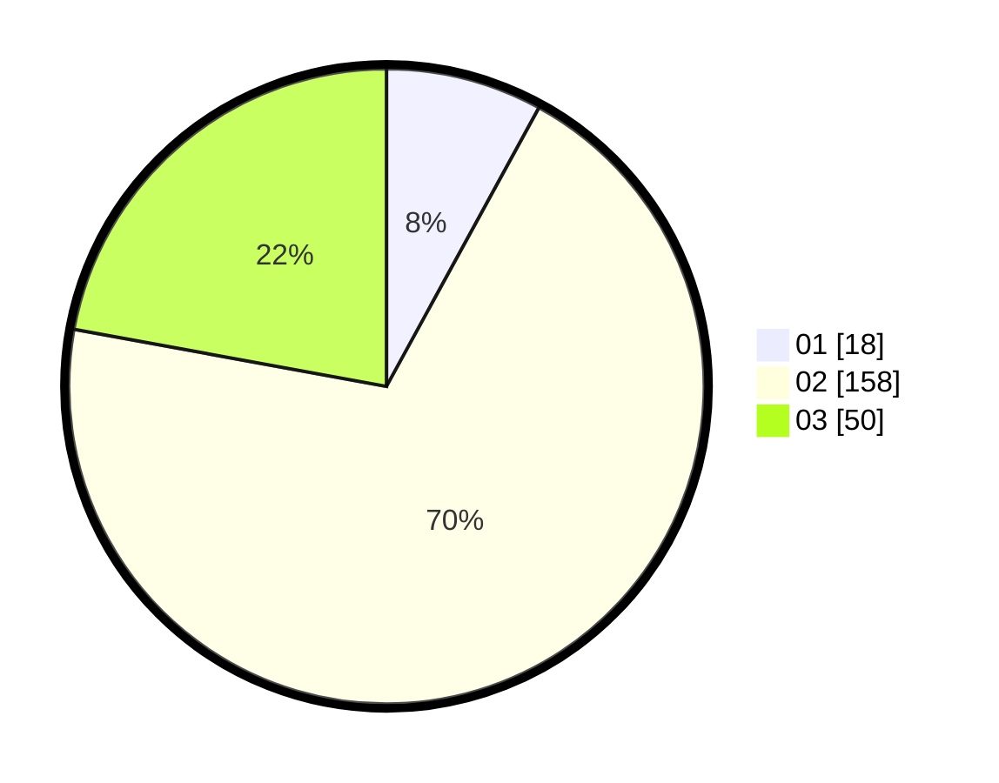

# Hasil

Hasil perolehan suara paslon dapat dilihat pada file paslon-01.txt, paslon-02.txt, dan paslon-03.txt.

Jika tidak ada, artinya data tersebut belum ada pada SIREKAP.

## Perolehan Suara

 * Paslon 01: **18**.
 * Paslon 02: **158**.
 * Paslon 03: **50**.

## Foto C Plano

https://sirekap-obj-formc.kpu.go.id/294f/pemilu/ppwp/31/73/01/10/05/3173011005168-20240215-015722--e6a808c2-0b9e-48b8-b53c-0bfe38e82b19.jpg

https://sirekap-obj-formc.kpu.go.id/294f/pemilu/ppwp/31/73/01/10/05/3173011005168-20240215-015745--65507c8c-2885-49ec-8da3-b27a0c7d9cef.jpg

https://sirekap-obj-formc.kpu.go.id/294f/pemilu/ppwp/31/73/01/10/05/3173011005168-20240215-015802--54fb2921-9b32-4e3d-a81f-0accc66146c1.jpg

## DATA PEMILIH TETAP

Jumlah pemilih dalam DPT: **270**.
 * L: **139**.
 * P: **142**.

## DATA PENGGUNA HAK PILIH

Jumlah pengguna hak pilih dalam DPT: **224**.
 * L: **97**.
 * P: **103**.

Jumlah pengguna hak pilih dalam DPTb: **5**.
 * L: **3**.
 * P: **2**.

Jumlah pengguna hak pilih dalam DPK: **5**.
 * L: **1**.
 * P: **1**.

Jumlah pengguna hak pilih: **551**.
 * L: **101**.
 * P: **120**.

## JUMLAH SUARA SAH DAN TIDAK SAH

JUMLAH SELURUH SUARA SAH: **226**.

JUMLAH SUARA TIDAK SAH: **1**.

JUMLAH SELURUH SUARA SAH DAN SUARA TIDAK SAH: **227**.
