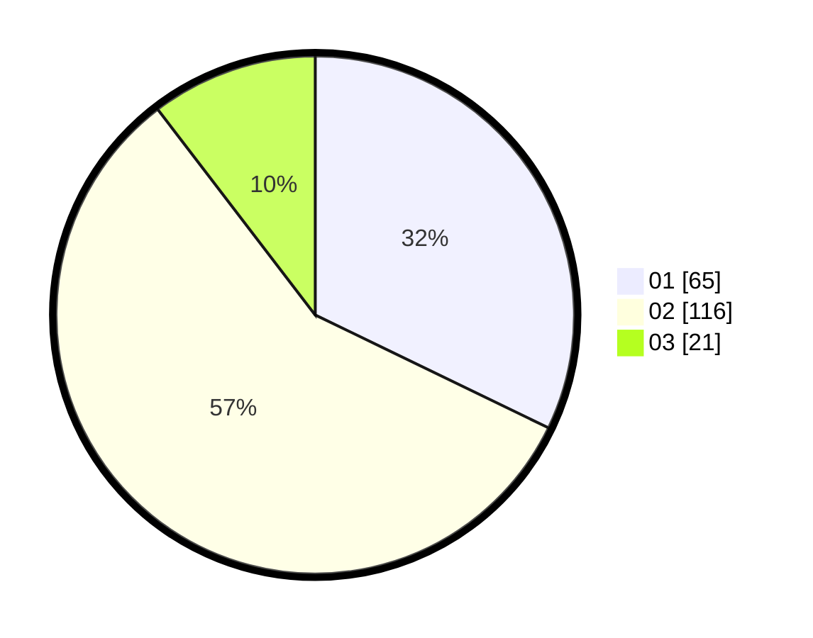

# Hasil

Hasil perolehan suara paslon dapat dilihat pada file paslon-01.txt, paslon-02.txt, dan paslon-03.txt.

Jika tidak ada, artinya data tersebut belum ada pada SIREKAP.

## Perolehan Suara

 * Paslon 01: **65**.
 * Paslon 02: **116**.
 * Paslon 03: **21**.

## Foto C Plano

https://sirekap-obj-formc.kpu.go.id/c957/pemilu/ppwp/31/73/01/10/05/3173011005171-20240214-232957--ba12173f-591c-450d-b876-bcfd1d453311.jpg

https://sirekap-obj-formc.kpu.go.id/c957/pemilu/ppwp/31/73/01/10/05/3173011005171-20240214-233013--96af1b53-49c5-47c1-8ad3-de1ea9a1c965.jpg

https://sirekap-obj-formc.kpu.go.id/c957/pemilu/ppwp/31/73/01/10/05/3173011005171-20240214-233022--06a96b21-6ccc-484d-a4ba-b021ac0cbb49.jpg
