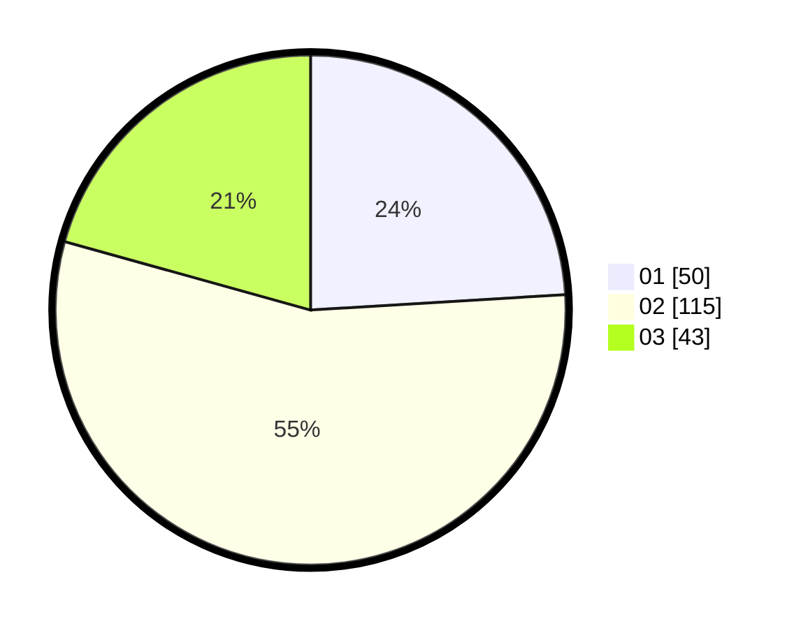

# Hasil

Hasil perolehan suara paslon dapat dilihat pada file paslon-01.txt, paslon-02.txt, dan paslon-03.txt.

Jika tidak ada, artinya data tersebut belum ada pada SIREKAP.

## Perolehan Suara

 * Paslon 01: **50**.
 * Paslon 02: **115**.
 * Paslon 03: **43**.

## Foto C Plano

https://sirekap-obj-formc.kpu.go.id/2830/pemilu/ppwp/31/73/01/10/05/3173011005173-20240216-032205--aeb798d6-80be-4457-ab93-be3a94af39c7.jpg

https://sirekap-obj-formc.kpu.go.id/2830/pemilu/ppwp/31/73/01/10/05/3173011005173-20240216-093904--c57fe082-c75a-4078-85a8-6d84ad39da43.jpg

https://sirekap-obj-formc.kpu.go.id/2830/pemilu/ppwp/31/73/01/10/05/3173011005173-20240216-032206--ac41d371-0772-440a-824d-3dba6b91b413.jpg

## DATA PEMILIH TETAP

Jumlah pemilih dalam DPT: **210**.
 * L: **97**.
 * P: **113**.

## DATA PENGGUNA HAK PILIH

Jumlah pengguna hak pilih dalam DPT: **210**.
 * L: **97**.
 * P: **113**.

Jumlah pengguna hak pilih dalam DPTb: **1**.
 * L: **0**.
 * P: **1**.

Jumlah pengguna hak pilih dalam DPK: **0**.
 * L: **0**.
 * P: **0**.

Jumlah pengguna hak pilih: **211**.
 * L: **97**.
 * P: **114**.

## JUMLAH SUARA SAH DAN TIDAK SAH

JUMLAH SELURUH SUARA SAH: **208**.

JUMLAH SUARA TIDAK SAH: **3**.

JUMLAH SELURUH SUARA SAH DAN SUARA TIDAK SAH: **211**.
