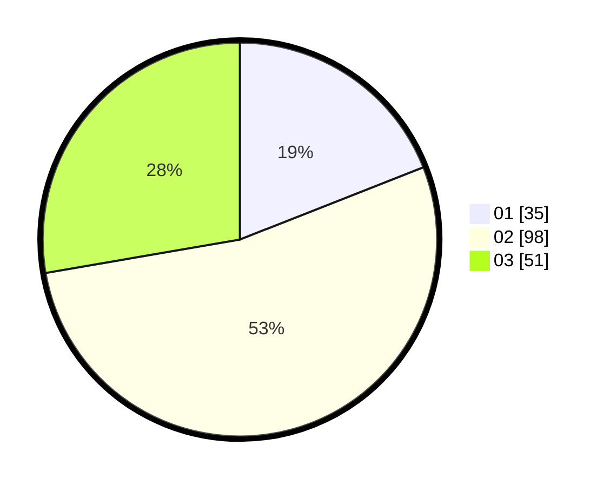

# Hasil

Hasil perolehan suara paslon dapat dilihat pada file paslon-01.txt, paslon-02.txt, dan paslon-03.txt.

Jika tidak ada, artinya data tersebut belum ada pada SIREKAP.

## Perolehan Suara

 * Paslon 01: **35**.
 * Paslon 02: **98**.
 * Paslon 03: **51**.

## Foto C Plano

https://sirekap-obj-formc.kpu.go.id/602d/pemilu/ppwp/31/73/01/10/05/3173011005174-20240214-155058--aed4b865-af67-44cf-af9f-cbc16459440a.jpg

https://sirekap-obj-formc.kpu.go.id/602d/pemilu/ppwp/31/73/01/10/05/3173011005174-20240214-155915--58e1f462-e758-4237-94d9-79cf00c60734.jpg

https://sirekap-obj-formc.kpu.go.id/602d/pemilu/ppwp/31/73/01/10/05/3173011005174-20240214-155313--985d9864-8b6d-4c9d-8242-14d3c3bdde2c.jpg

## DATA PEMILIH TETAP

Jumlah pemilih dalam DPT: **267**.
 * L: **128**.
 * P: **139**.

## DATA PENGGUNA HAK PILIH

Jumlah pengguna hak pilih dalam DPT: **186**.
 * L: **90**.
 * P: **96**.

Jumlah pengguna hak pilih dalam DPTb: **0**.
 * L: **0**.
 * P: **0**.

Jumlah pengguna hak pilih dalam DPK: **1**.
 * L: **0**.
 * P: **1**.

Jumlah pengguna hak pilih: **187**.
 * L: **90**.
 * P: **97**.

## JUMLAH SUARA SAH DAN TIDAK SAH

JUMLAH SELURUH SUARA SAH: **184**.

JUMLAH SUARA TIDAK SAH: **3**.

JUMLAH SELURUH SUARA SAH DAN SUARA TIDAK SAH: **187**.
