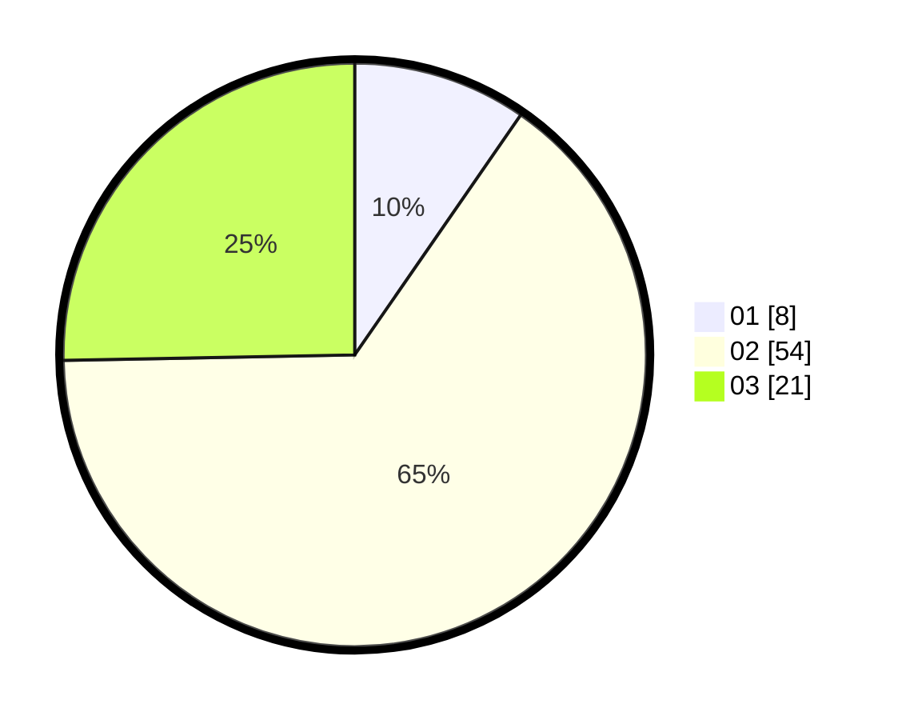

# Hasil

Hasil perolehan suara paslon dapat dilihat pada file paslon-01.txt, paslon-02.txt, dan paslon-03.txt.

Jika tidak ada, artinya data tersebut belum ada pada SIREKAP.

## Perolehan Suara

 * Paslon 01: **8**.
 * Paslon 02: **54**.
 * Paslon 03: **21**.

## Foto C Plano

https://sirekap-obj-formc.kpu.go.id/192b/pemilu/ppwp/31/73/01/10/05/3173011005176-20240216-032648--291813c0-10fe-42cc-a085-dfdafff901a1.jpg

https://sirekap-obj-formc.kpu.go.id/192b/pemilu/ppwp/31/73/01/10/05/3173011005176-20240216-032650--c28ddd60-59c0-4dc5-80c8-ee7d1bf1a6c7.jpg

https://sirekap-obj-formc.kpu.go.id/192b/pemilu/ppwp/31/73/01/10/05/3173011005176-20240216-032649--c995d794-447e-4be9-8d06-824a009d8475.jpg

## DATA PEMILIH TETAP

Jumlah pemilih dalam DPT: **119**.
 * L: **56**.
 * P: **63**.

## DATA PENGGUNA HAK PILIH

Jumlah pengguna hak pilih dalam DPT: **83**.
 * L: **38**.
 * P: **45**.

Jumlah pengguna hak pilih dalam DPTb: **0**.
 * L: **0**.
 * P: **0**.

Jumlah pengguna hak pilih dalam DPK: **0**.
 * L: **0**.
 * P: **0**.

Jumlah pengguna hak pilih: **83**.
 * L: **38**.
 * P: **45**.

## JUMLAH SUARA SAH DAN TIDAK SAH

JUMLAH SELURUH SUARA SAH: **83**.

JUMLAH SUARA TIDAK SAH: **0**.

JUMLAH SELURUH SUARA SAH DAN SUARA TIDAK SAH: **83**.
