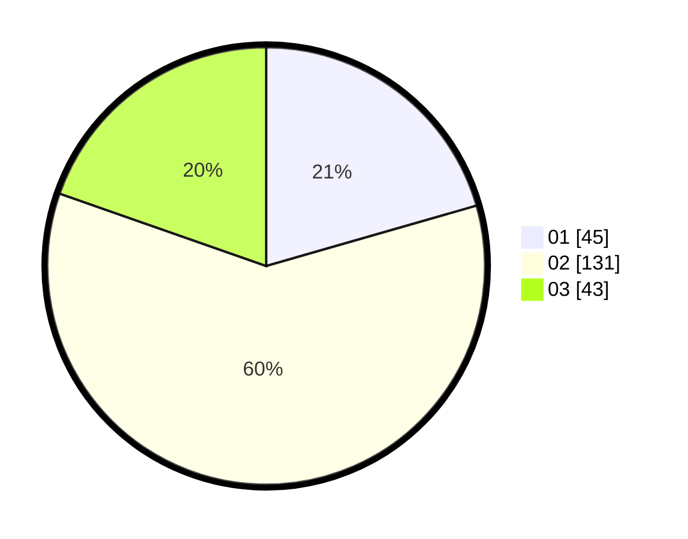

# Hasil

Hasil perolehan suara paslon dapat dilihat pada file paslon-01.txt, paslon-02.txt, dan paslon-03.txt.

Jika tidak ada, artinya data tersebut belum ada pada SIREKAP.

## Perolehan Suara

 * Paslon 01: **45**.
 * Paslon 02: **131**.
 * Paslon 03: **43**.

## Foto C Plano

https://sirekap-obj-formc.kpu.go.id/e80e/pemilu/ppwp/31/73/01/10/05/3173011005178-20240215-033736--c3d9c237-7532-446d-af7c-3c2c80b51e6b.jpg

https://sirekap-obj-formc.kpu.go.id/e80e/pemilu/ppwp/31/73/01/10/05/3173011005178-20240215-035436--bfd11afd-bf6c-4fb2-b433-4ac886497294.jpg
