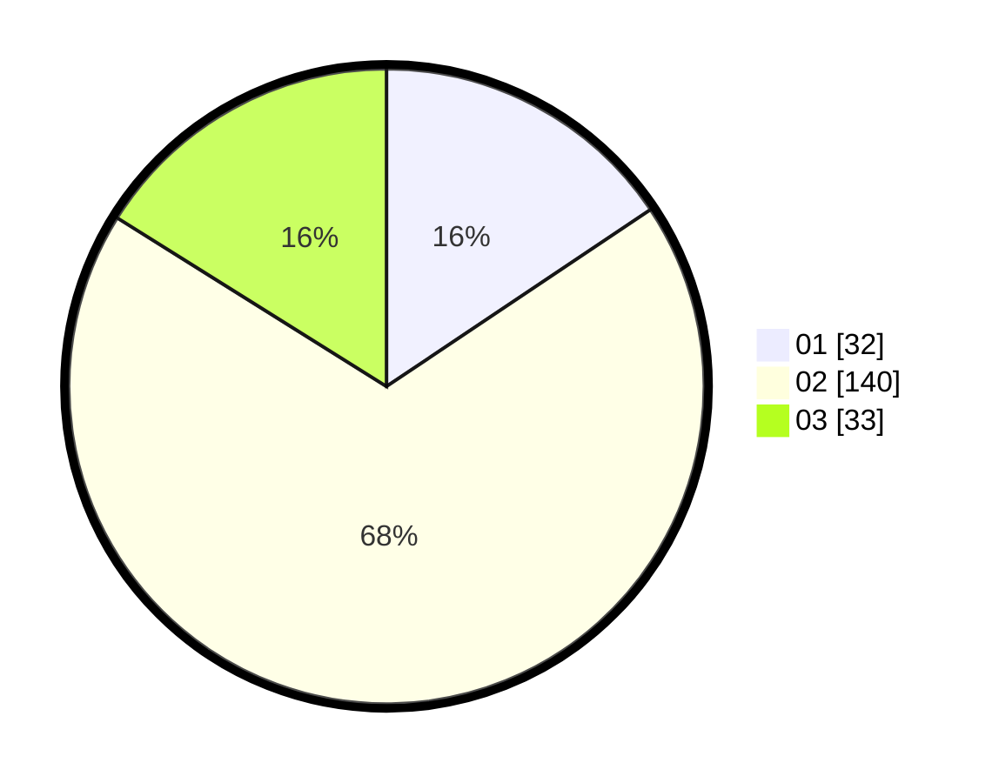

# Hasil

Hasil perolehan suara paslon dapat dilihat pada file paslon-01.txt, paslon-02.txt, dan paslon-03.txt.

Jika tidak ada, artinya data tersebut belum ada pada SIREKAP.

## Perolehan Suara

 * Paslon 01: **32**.
 * Paslon 02: **140**.
 * Paslon 03: **33**.

## Foto C Plano

https://sirekap-obj-formc.kpu.go.id/ff4f/pemilu/ppwp/31/73/01/10/05/3173011005181-20240215-015825--10e27057-6a17-48b4-9284-57040a6ad006.jpg

https://sirekap-obj-formc.kpu.go.id/ff4f/pemilu/ppwp/31/73/01/10/05/3173011005181-20240214-213644--6b999488-30be-4aae-9814-3cef8281fa87.jpg

https://sirekap-obj-formc.kpu.go.id/ff4f/pemilu/ppwp/31/73/01/10/05/3173011005181-20240214-223728--dec0fd03-530f-4a7d-abfd-fd5154d69656.jpg
