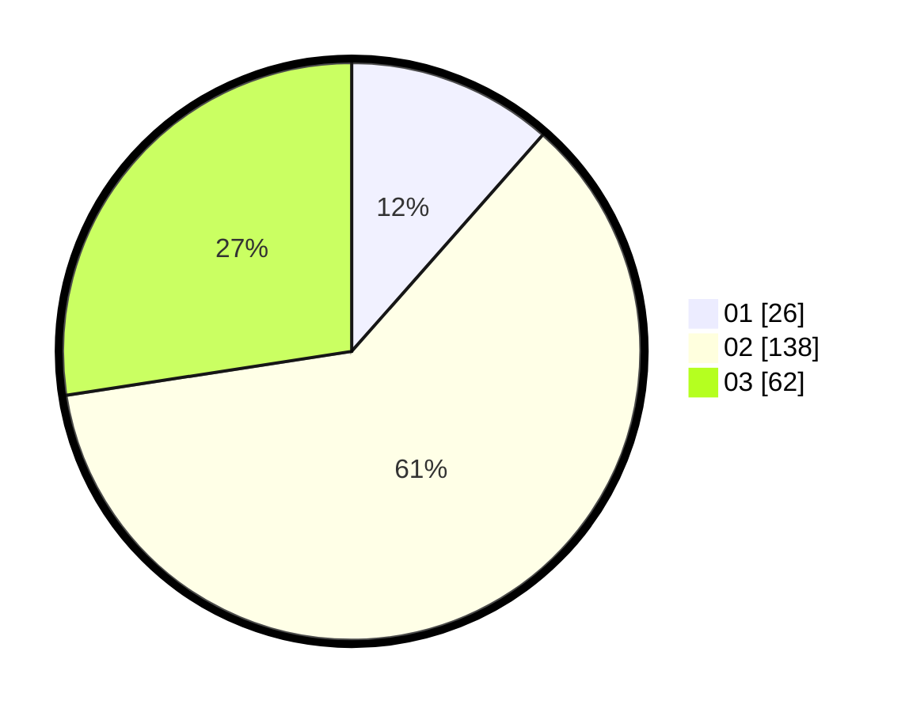

# Hasil

Hasil perolehan suara paslon dapat dilihat pada file paslon-01.txt, paslon-02.txt, dan paslon-03.txt.

Jika tidak ada, artinya data tersebut belum ada pada SIREKAP.

## Perolehan Suara

 * Paslon 01: **26**.
 * Paslon 02: **138**.
 * Paslon 03: **62**.

## Foto C Plano

https://sirekap-obj-formc.kpu.go.id/14d0/pemilu/ppwp/31/73/01/10/05/3173011005182-20240215-222823--57e84c42-6901-4131-ad6f-7395516dba25.jpg

https://sirekap-obj-formc.kpu.go.id/14d0/pemilu/ppwp/31/73/01/10/05/3173011005182-20240215-222825--c2b6c334-faf4-4e6f-b4ed-65b1529628b9.jpg

https://sirekap-obj-formc.kpu.go.id/14d0/pemilu/ppwp/31/73/01/10/05/3173011005182-20240215-222824--10338930-e1ae-4349-b47e-4d6496c9f439.jpg

## DATA PEMILIH TETAP

Jumlah pemilih dalam DPT: **286**.
 * L: **139**.
 * P: **147**.

## DATA PENGGUNA HAK PILIH

Jumlah pengguna hak pilih dalam DPT: **227**.
 * L: **109**.
 * P: **118**.

Jumlah pengguna hak pilih dalam DPTb: **0**.
 * L: **0**.
 * P: **0**.

Jumlah pengguna hak pilih dalam DPK: **1**.
 * L: **0**.
 * P: **1**.

Jumlah pengguna hak pilih: **228**.
 * L: **109**.
 * P: **119**.

## JUMLAH SUARA SAH DAN TIDAK SAH

JUMLAH SELURUH SUARA SAH: **226**.

JUMLAH SUARA TIDAK SAH: **2**.

JUMLAH SELURUH SUARA SAH DAN SUARA TIDAK SAH: **228**.
