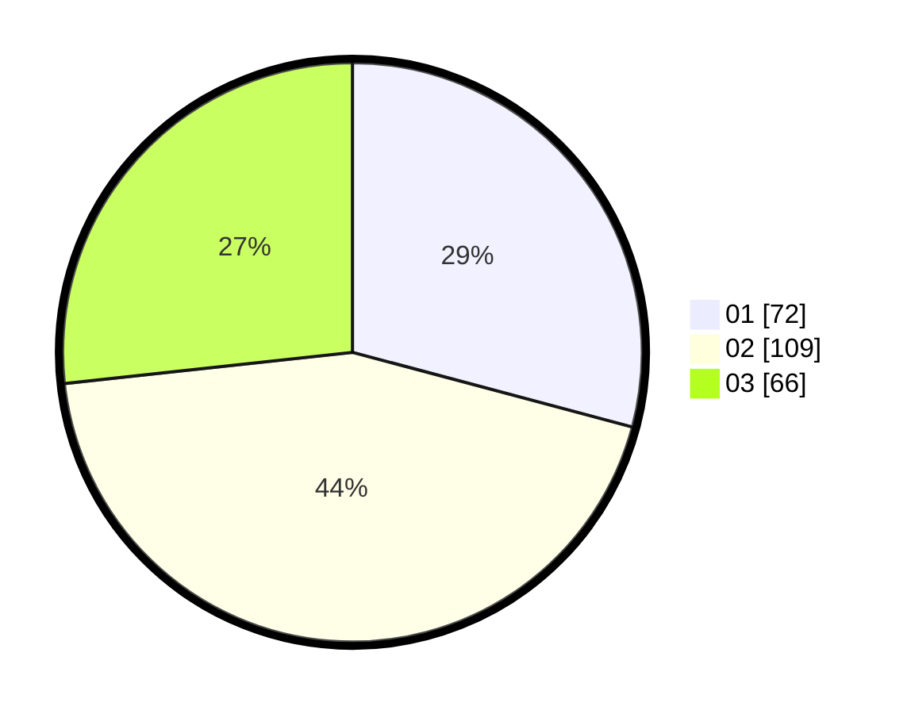

# Hasil

Hasil perolehan suara paslon dapat dilihat pada file paslon-01.txt, paslon-02.txt, dan paslon-03.txt.

Jika tidak ada, artinya data tersebut belum ada pada SIREKAP.

## Perolehan Suara

 * Paslon 01: **72**.
 * Paslon 02: **109**.
 * Paslon 03: **66**.

## Foto C Plano

https://sirekap-obj-formc.kpu.go.id/e785/pemilu/ppwp/31/73/01/10/05/3173011005195-20240214-211448--1a29879d-fb62-4899-9030-824b0117ffde.jpg

https://sirekap-obj-formc.kpu.go.id/e785/pemilu/ppwp/31/73/01/10/05/3173011005195-20240214-211730--c9a36202-796e-468d-b469-dae153d31931.jpg

https://sirekap-obj-formc.kpu.go.id/e785/pemilu/ppwp/31/73/01/10/05/3173011005195-20240215-030720--c5d59d90-6326-4684-bb3b-97d22af79dcd.jpg
