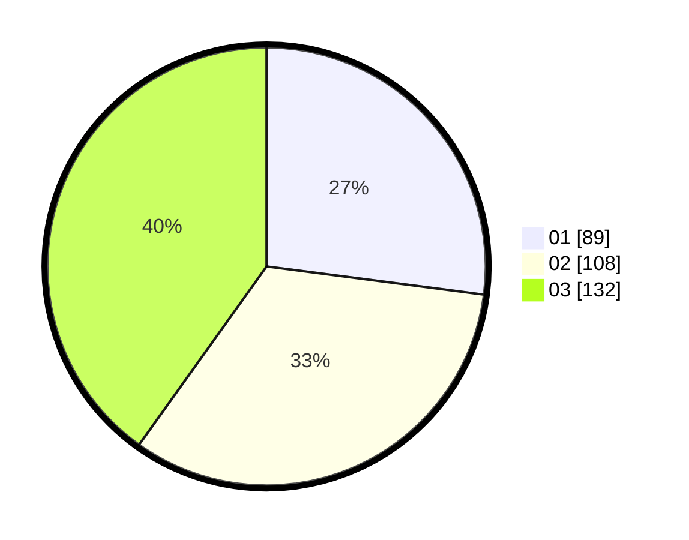

# Hasil

Hasil perolehan suara paslon dapat dilihat pada file paslon-01.txt, paslon-02.txt, dan paslon-03.txt.

Jika tidak ada, artinya data tersebut belum ada pada SIREKAP.

## Perolehan Suara

 * Paslon 01: **89**.
 * Paslon 02: **108**.
 * Paslon 03: **132**.

## Foto C Plano

https://sirekap-obj-formc.kpu.go.id/be65/pemilu/ppwp/31/73/01/10/05/3173011005198-20240214-225340--49fa3e61-1245-485d-b7a0-dedc744c75d1.jpg

https://sirekap-obj-formc.kpu.go.id/be65/pemilu/ppwp/31/73/01/10/05/3173011005198-20240214-225722--a573281b-e281-4585-a0e8-a7a762aef8bc.jpg

https://sirekap-obj-formc.kpu.go.id/be65/pemilu/ppwp/31/73/01/10/05/3173011005198-20240214-230502--a7ec8227-b146-480f-b5a3-78acb3b3e8af.jpg
