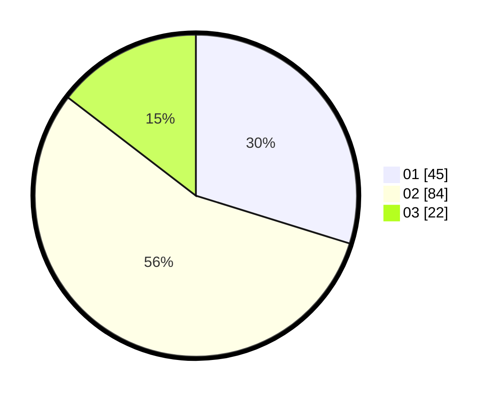

# Hasil

Hasil perolehan suara paslon dapat dilihat pada file paslon-01.txt, paslon-02.txt, dan paslon-03.txt.

Jika tidak ada, artinya data tersebut belum ada pada SIREKAP.

## Perolehan Suara

 * Paslon 01: **45**.
 * Paslon 02: **84**.
 * Paslon 03: **22**.

## Foto C Plano

https://sirekap-obj-formc.kpu.go.id/9d98/pemilu/ppwp/31/73/01/10/05/3173011005201-20240216-025415--221ba270-117e-42a5-95a2-8b1e354d5a6a.jpg

https://sirekap-obj-formc.kpu.go.id/9d98/pemilu/ppwp/31/73/01/10/05/3173011005201-20240216-025419--f37a6917-1d3f-48d6-9dcb-23eac350eeab.jpg

https://sirekap-obj-formc.kpu.go.id/9d98/pemilu/ppwp/31/73/01/10/05/3173011005201-20240216-025418--24886357-5b35-420a-836b-12d77ae627e3.jpg

## DATA PEMILIH TETAP

Jumlah pemilih dalam DPT: **187**.
 * L: **92**.
 * P: **95**.

## DATA PENGGUNA HAK PILIH

Jumlah pengguna hak pilih dalam DPT: **152**.
 * L: **73**.
 * P: **79**.

Jumlah pengguna hak pilih dalam DPTb: **0**.
 * L: **0**.
 * P: **0**.

Jumlah pengguna hak pilih dalam DPK: **0**.
 * L: **0**.
 * P: **0**.

Jumlah pengguna hak pilih: **152**.
 * L: **73**.
 * P: **79**.

## JUMLAH SUARA SAH DAN TIDAK SAH

JUMLAH SELURUH SUARA SAH: **151**.

JUMLAH SUARA TIDAK SAH: **1**.

JUMLAH SELURUH SUARA SAH DAN SUARA TIDAK SAH: **152**.
