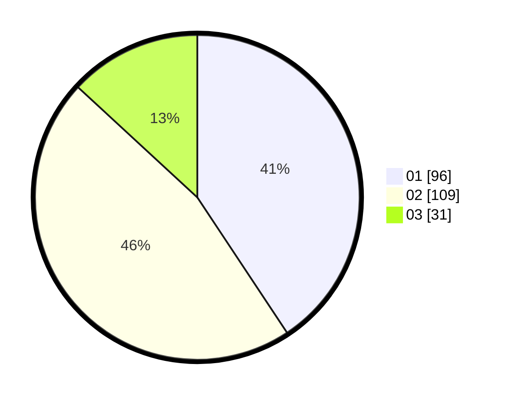

# Hasil

Hasil perolehan suara paslon dapat dilihat pada file paslon-01.txt, paslon-02.txt, dan paslon-03.txt.

Jika tidak ada, artinya data tersebut belum ada pada SIREKAP.

## Perolehan Suara

 * Paslon 01: **96**.
 * Paslon 02: **109**.
 * Paslon 03: **31**.

## Foto C Plano

https://sirekap-obj-formc.kpu.go.id/f2b6/pemilu/ppwp/31/73/01/10/05/3173011005202-20240215-002243--a39f953c-3b0a-4f38-b6e5-7755850a0ffd.jpg

https://sirekap-obj-formc.kpu.go.id/f2b6/pemilu/ppwp/31/73/01/10/05/3173011005202-20240215-002407--b0c3df10-8a8a-4ca1-90ad-4a9e0bb71ddb.jpg

https://sirekap-obj-formc.kpu.go.id/f2b6/pemilu/ppwp/31/73/01/10/05/3173011005202-20240215-002608--d283170c-4455-4803-abe3-f1ac715f4a28.jpg
