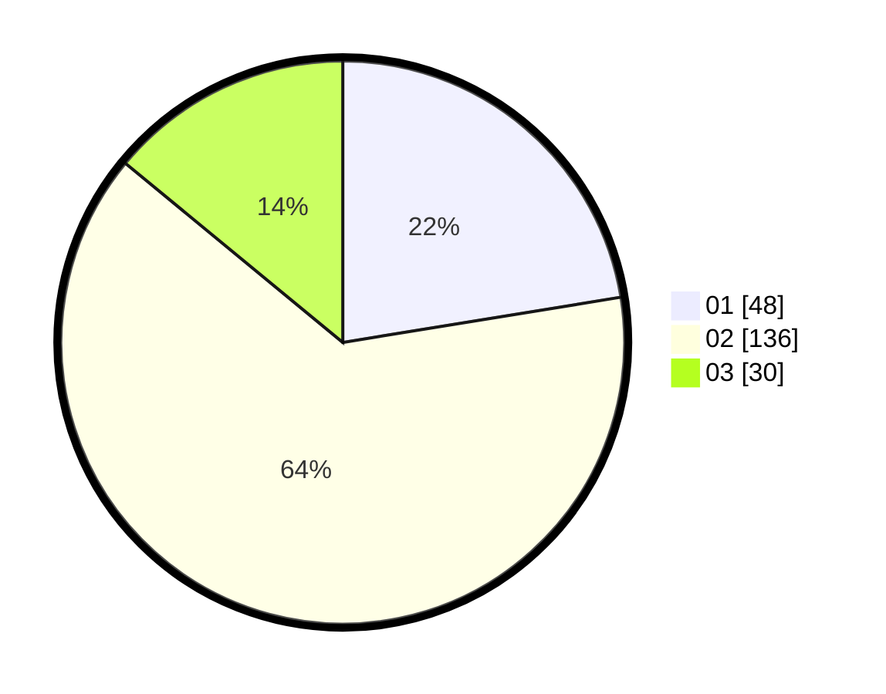

# Hasil

Hasil perolehan suara paslon dapat dilihat pada file paslon-01.txt, paslon-02.txt, dan paslon-03.txt.

Jika tidak ada, artinya data tersebut belum ada pada SIREKAP.

## Perolehan Suara

 * Paslon 01: **48**.
 * Paslon 02: **136**.
 * Paslon 03: **30**.

## Foto C Plano

https://sirekap-obj-formc.kpu.go.id/edcf/pemilu/ppwp/31/73/01/10/05/3173011005206-20240214-205751--c947dba6-5b2f-429d-b821-11fe1763cfb7.jpg

https://sirekap-obj-formc.kpu.go.id/edcf/pemilu/ppwp/31/73/01/10/05/3173011005206-20240214-202357--f60de0cf-cf07-4216-9b08-8195529be7b4.jpg

https://sirekap-obj-formc.kpu.go.id/edcf/pemilu/ppwp/31/73/01/10/05/3173011005206-20240215-003739--0e067ece-572c-4c9b-b6d7-93d268e57c22.jpg

## DATA PEMILIH TETAP

Jumlah pemilih dalam DPT: **295**.
 * L: **155**.
 * P: **140**.

## DATA PENGGUNA HAK PILIH

Jumlah pengguna hak pilih dalam DPT: **212**.
 * L: **110**.
 * P: **102**.

Jumlah pengguna hak pilih dalam DPTb: **1**.
 * L: **0**.
 * P: **1**.

Jumlah pengguna hak pilih dalam DPK: **4**.
 * L: **2**.
 * P: **2**.

Jumlah pengguna hak pilih: **217**.
 * L: **112**.
 * P: **105**.

## JUMLAH SUARA SAH DAN TIDAK SAH

JUMLAH SELURUH SUARA SAH: **214**.

JUMLAH SUARA TIDAK SAH: **3**.

JUMLAH SELURUH SUARA SAH DAN SUARA TIDAK SAH: **217**.
