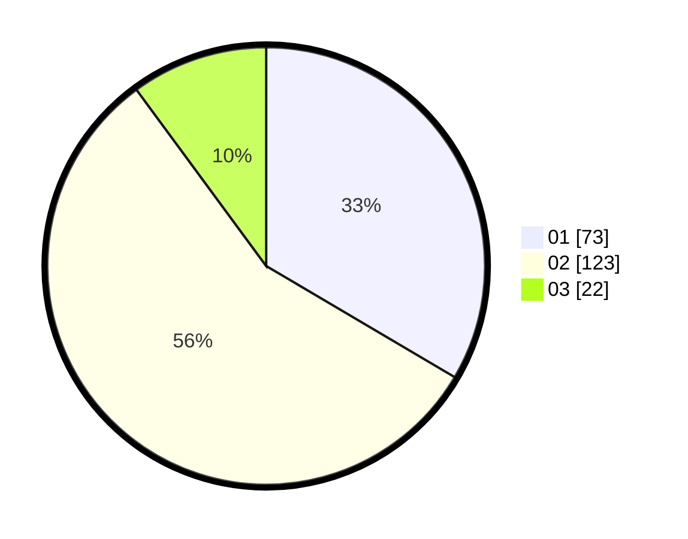

# Hasil

Hasil perolehan suara paslon dapat dilihat pada file paslon-01.txt, paslon-02.txt, dan paslon-03.txt.

Jika tidak ada, artinya data tersebut belum ada pada SIREKAP.

## Perolehan Suara

 * Paslon 01: **73**.
 * Paslon 02: **123**.
 * Paslon 03: **22**.

## Foto C Plano

https://sirekap-obj-formc.kpu.go.id/dd2d/pemilu/ppwp/31/73/01/10/05/3173011005209-20240216-143011--29bd38d8-e34e-4c50-a76c-ebcb7d09bc16.jpg

https://sirekap-obj-formc.kpu.go.id/dd2d/pemilu/ppwp/31/73/01/10/05/3173011005209-20240216-143012--33b92e3b-d9ed-4937-b3d1-097be8451c73.jpg

https://sirekap-obj-formc.kpu.go.id/dd2d/pemilu/ppwp/31/73/01/10/05/3173011005209-20240216-143012--80acf407-b910-4c9b-99ac-e75555ad0d62.jpg

## DATA PEMILIH TETAP

Jumlah pemilih dalam DPT: **288**.
 * L: **140**.
 * P: **148**.

## DATA PENGGUNA HAK PILIH

Jumlah pengguna hak pilih dalam DPT: **223**.
 * L: **119**.
 * P: **104**.

Jumlah pengguna hak pilih dalam DPTb: **0**.
 * L: **0**.
 * P: **0**.

Jumlah pengguna hak pilih dalam DPK: **2**.
 * L: **2**.
 * P: **0**.

Jumlah pengguna hak pilih: **225**.
 * L: **121**.
 * P: **104**.

## JUMLAH SUARA SAH DAN TIDAK SAH

JUMLAH SELURUH SUARA SAH: **218**.

JUMLAH SUARA TIDAK SAH: **7**.

JUMLAH SELURUH SUARA SAH DAN SUARA TIDAK SAH: **225**.
