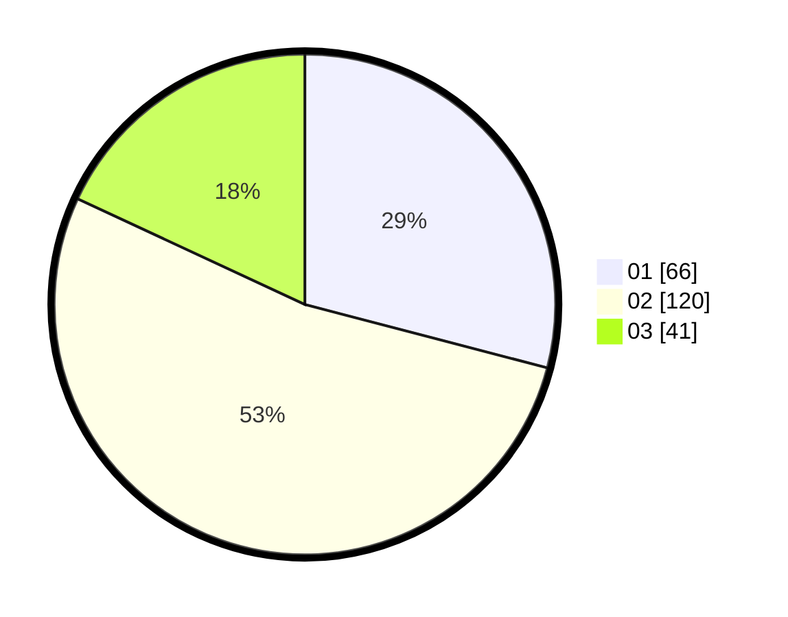

# Hasil

Hasil perolehan suara paslon dapat dilihat pada file paslon-01.txt, paslon-02.txt, dan paslon-03.txt.

Jika tidak ada, artinya data tersebut belum ada pada SIREKAP.

## Perolehan Suara

 * Paslon 01: **66**.
 * Paslon 02: **120**.
 * Paslon 03: **41**.

## Foto C Plano

https://sirekap-obj-formc.kpu.go.id/88e8/pemilu/ppwp/31/73/01/10/05/3173011005210-20240215-070850--e83e55cf-11c3-49df-90d0-c2b2f4389690.jpg

https://sirekap-obj-formc.kpu.go.id/88e8/pemilu/ppwp/31/73/01/10/05/3173011005210-20240215-071117--11cbb248-afc1-4d14-ba13-832b8a5d603a.jpg

https://sirekap-obj-formc.kpu.go.id/88e8/pemilu/ppwp/31/73/01/10/05/3173011005210-20240215-071359--aefe4f08-785b-4f69-baf9-758bd035aa85.jpg

## DATA PEMILIH TETAP

Jumlah pemilih dalam DPT: **286**.
 * L: **144**.
 * P: **142**.

## DATA PENGGUNA HAK PILIH

Jumlah pengguna hak pilih dalam DPT: **230**.
 * L: **111**.
 * P: **119**.

Jumlah pengguna hak pilih dalam DPTb: **0**.
 * L: **0**.
 * P: **0**.

Jumlah pengguna hak pilih dalam DPK: **0**.
 * L: **0**.
 * P: **0**.

Jumlah pengguna hak pilih: **230**.
 * L: **111**.
 * P: **119**.

## JUMLAH SUARA SAH DAN TIDAK SAH

JUMLAH SELURUH SUARA SAH: **227**.

JUMLAH SUARA TIDAK SAH: **3**.

JUMLAH SELURUH SUARA SAH DAN SUARA TIDAK SAH: **230**.
