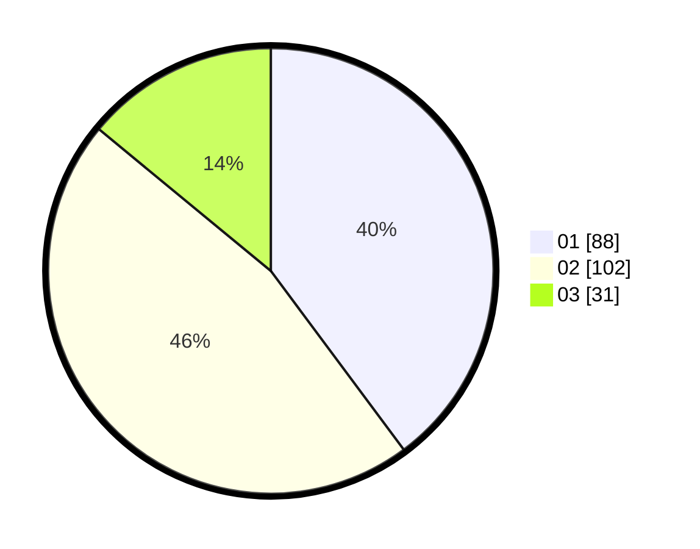

# Hasil

Hasil perolehan suara paslon dapat dilihat pada file paslon-01.txt, paslon-02.txt, dan paslon-03.txt.

Jika tidak ada, artinya data tersebut belum ada pada SIREKAP.

## Perolehan Suara

 * Paslon 01: **88**.
 * Paslon 02: **102**.
 * Paslon 03: **31**.

## Foto C Plano

https://sirekap-obj-formc.kpu.go.id/2fc7/pemilu/ppwp/31/73/01/10/05/3173011005215-20240214-191323--721cb22e-a493-4de9-84a1-0cf5c002e2da.jpg

https://sirekap-obj-formc.kpu.go.id/2fc7/pemilu/ppwp/31/73/01/10/05/3173011005215-20240214-192857--a428c6db-cf2a-455f-bab6-9ad2c8a88298.jpg

https://sirekap-obj-formc.kpu.go.id/2fc7/pemilu/ppwp/31/73/01/10/05/3173011005215-20240214-192214--00829b73-74e1-4f25-a861-35ad0f1cc401.jpg

## DATA PEMILIH TETAP

Jumlah pemilih dalam DPT: **291**.
 * L: **146**.
 * P: **145**.

## DATA PENGGUNA HAK PILIH

Jumlah pengguna hak pilih dalam DPT: **221**.
 * L: **107**.
 * P: **114**.

Jumlah pengguna hak pilih dalam DPTb: **3**.
 * L: **3**.
 * P: **0**.

Jumlah pengguna hak pilih dalam DPK: **2**.
 * L: **1**.
 * P: **1**.

Jumlah pengguna hak pilih: **226**.
 * L: **111**.
 * P: **115**.

## JUMLAH SUARA SAH DAN TIDAK SAH

JUMLAH SELURUH SUARA SAH: **221**.

JUMLAH SUARA TIDAK SAH: **5**.

JUMLAH SELURUH SUARA SAH DAN SUARA TIDAK SAH: **226**.
