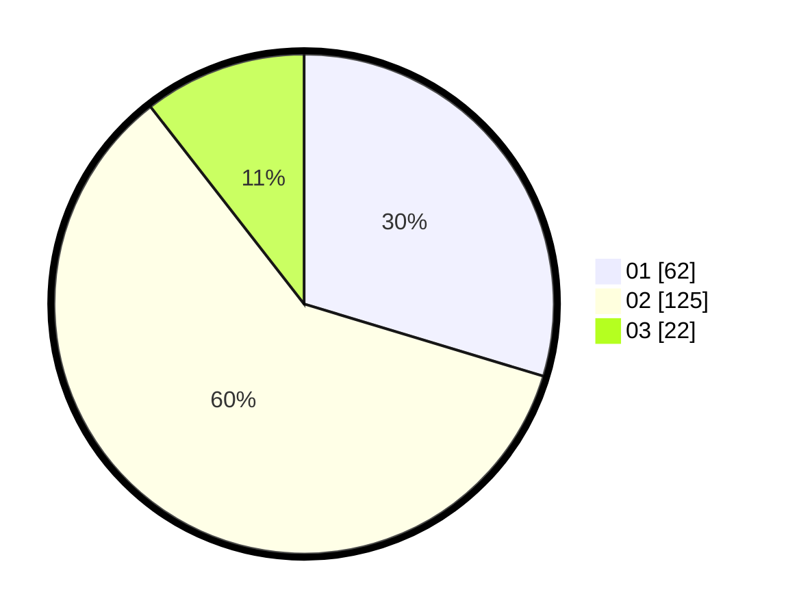

# Hasil

Hasil perolehan suara paslon dapat dilihat pada file paslon-01.txt, paslon-02.txt, dan paslon-03.txt.

Jika tidak ada, artinya data tersebut belum ada pada SIREKAP.

## Perolehan Suara

 * Paslon 01: **62**.
 * Paslon 02: **125**.
 * Paslon 03: **22**.

## Foto C Plano

https://sirekap-obj-formc.kpu.go.id/cce1/pemilu/ppwp/31/73/01/10/05/3173011005222-20240214-222550--f5093eb6-050f-4034-8d55-5a4131cb6fdc.jpg

https://sirekap-obj-formc.kpu.go.id/cce1/pemilu/ppwp/31/73/01/10/05/3173011005222-20240214-220903--fedcf480-1d7e-4b51-8091-b2936753e931.jpg

https://sirekap-obj-formc.kpu.go.id/cce1/pemilu/ppwp/31/73/01/10/05/3173011005222-20240214-221042--9bc04718-ac5a-4251-ad8b-0a5340e5e4db.jpg
