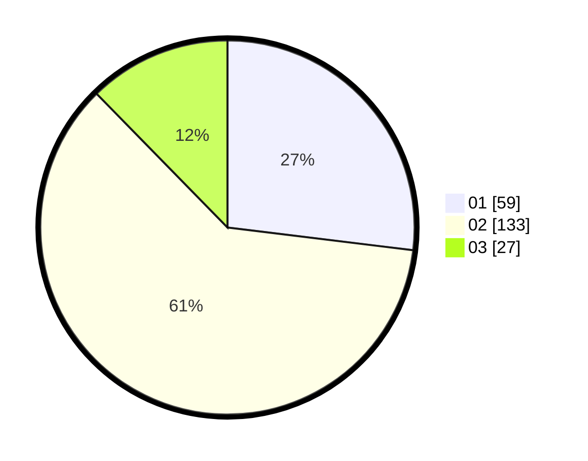

# Hasil

Hasil perolehan suara paslon dapat dilihat pada file paslon-01.txt, paslon-02.txt, dan paslon-03.txt.

Jika tidak ada, artinya data tersebut belum ada pada SIREKAP.

## Perolehan Suara

 * Paslon 01: **59**.
 * Paslon 02: **133**.
 * Paslon 03: **27**.

## Foto C Plano

https://sirekap-obj-formc.kpu.go.id/fd81/pemilu/ppwp/31/73/01/10/05/3173011005224-20240214-204940--9eac9430-9f83-4489-84fe-135b4280394a.jpg

https://sirekap-obj-formc.kpu.go.id/fd81/pemilu/ppwp/31/73/01/10/05/3173011005224-20240214-204553--1d6b4fcb-5a21-4922-b325-62b97694bd75.jpg

https://sirekap-obj-formc.kpu.go.id/fd81/pemilu/ppwp/31/73/01/10/05/3173011005224-20240214-225856--8fd5e3b0-8c0e-40bc-9274-57a625ca1a2a.jpg
