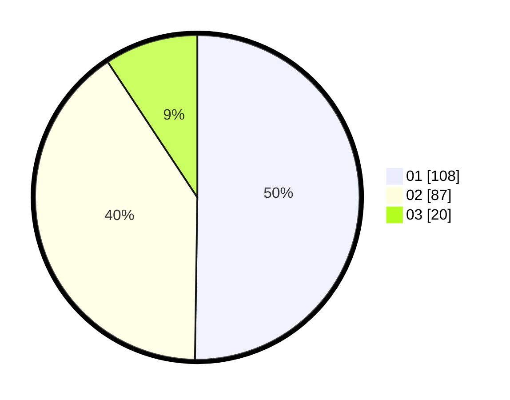

# Hasil

Hasil perolehan suara paslon dapat dilihat pada file paslon-01.txt, paslon-02.txt, dan paslon-03.txt.

Jika tidak ada, artinya data tersebut belum ada pada SIREKAP.

## Perolehan Suara

 * Paslon 01: **108**.
 * Paslon 02: **87**.
 * Paslon 03: **20**.

## Foto C Plano

https://sirekap-obj-formc.kpu.go.id/5327/pemilu/ppwp/31/73/01/10/05/3173011005230-20240216-162500--1cbc2372-4604-46de-a7d8-beeadc5e4778.jpg

https://sirekap-obj-formc.kpu.go.id/5327/pemilu/ppwp/31/73/01/10/05/3173011005230-20240216-162501--4dbbbf0e-6be3-4097-aad0-713b1fa5821c.jpg

https://sirekap-obj-formc.kpu.go.id/5327/pemilu/ppwp/31/73/01/10/05/3173011005230-20240216-162500--4b932505-af77-43d3-ba44-40318e825100.jpg

## DATA PEMILIH TETAP

Jumlah pemilih dalam DPT: **289**.
 * L: **139**.
 * P: **150**.

## DATA PENGGUNA HAK PILIH

Jumlah pengguna hak pilih dalam DPT: **218**.
 * L: **106**.
 * P: **112**.

Jumlah pengguna hak pilih dalam DPTb: **1**.
 * L: **0**.
 * P: **1**.

Jumlah pengguna hak pilih dalam DPK: **0**.
 * L: **0**.
 * P: **0**.

Jumlah pengguna hak pilih: **219**.
 * L: **106**.
 * P: **113**.

## JUMLAH SUARA SAH DAN TIDAK SAH

JUMLAH SELURUH SUARA SAH: **215**.

JUMLAH SUARA TIDAK SAH: **4**.

JUMLAH SELURUH SUARA SAH DAN SUARA TIDAK SAH: **219**.
