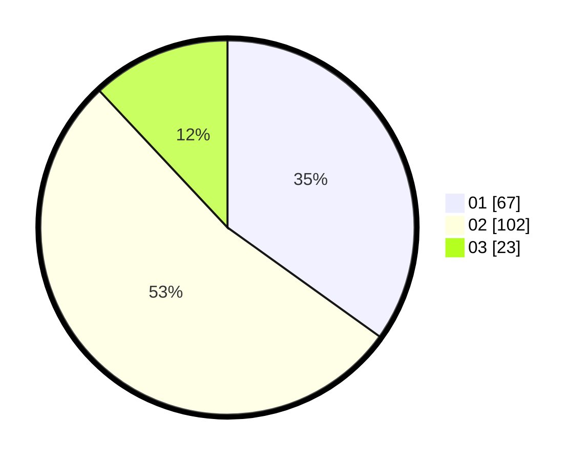

# Hasil

Hasil perolehan suara paslon dapat dilihat pada file paslon-01.txt, paslon-02.txt, dan paslon-03.txt.

Jika tidak ada, artinya data tersebut belum ada pada SIREKAP.

## Perolehan Suara

 * Paslon 01: **67**.
 * Paslon 02: **102**.
 * Paslon 03: **23**.

## Foto C Plano

https://sirekap-obj-formc.kpu.go.id/27a7/pemilu/ppwp/31/73/01/10/05/3173011005231-20240216-231143--06271c7b-2da9-48a3-b05d-e808096f5565.jpg

https://sirekap-obj-formc.kpu.go.id/27a7/pemilu/ppwp/31/73/01/10/05/3173011005231-20240216-231144--7055fee2-1238-453d-a4f2-9b234a2c4736.jpg

https://sirekap-obj-formc.kpu.go.id/27a7/pemilu/ppwp/31/73/01/10/05/3173011005231-20240216-231144--141c96f7-1ac3-47a0-b928-a4e551939b52.jpg

## DATA PEMILIH TETAP

Jumlah pemilih dalam DPT: **290**.
 * L: **149**.
 * P: **141**.

## DATA PENGGUNA HAK PILIH

Jumlah pengguna hak pilih dalam DPT: **194**.
 * L: **97**.
 * P: **97**.

Jumlah pengguna hak pilih dalam DPTb: **0**.
 * L: **0**.
 * P: **0**.

Jumlah pengguna hak pilih dalam DPK: **1**.
 * L: **0**.
 * P: **1**.

Jumlah pengguna hak pilih: **195**.
 * L: **97**.
 * P: **98**.

## JUMLAH SUARA SAH DAN TIDAK SAH

JUMLAH SELURUH SUARA SAH: **192**.

JUMLAH SUARA TIDAK SAH: **3**.

JUMLAH SELURUH SUARA SAH DAN SUARA TIDAK SAH: **195**.
