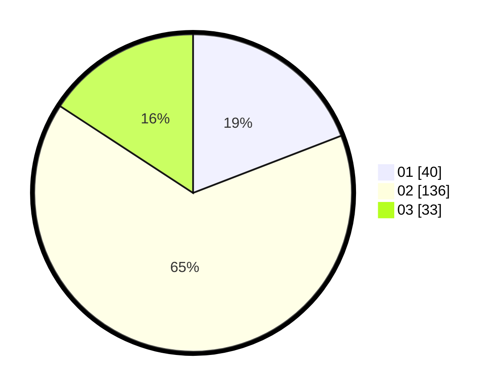

# Hasil

Hasil perolehan suara paslon dapat dilihat pada file paslon-01.txt, paslon-02.txt, dan paslon-03.txt.

Jika tidak ada, artinya data tersebut belum ada pada SIREKAP.

## Perolehan Suara

 * Paslon 01: **40**.
 * Paslon 02: **136**.
 * Paslon 03: **33**.

## Foto C Plano

https://sirekap-obj-formc.kpu.go.id/e896/pemilu/ppwp/31/73/01/10/05/3173011005232-20240214-230319--3a26ead5-d976-4389-bbef-4523869a6067.jpg

https://sirekap-obj-formc.kpu.go.id/e896/pemilu/ppwp/31/73/01/10/05/3173011005232-20240215-014331--581c9196-e848-4c94-9379-86a8dc84593f.jpg

https://sirekap-obj-formc.kpu.go.id/e896/pemilu/ppwp/31/73/01/10/05/3173011005232-20240215-015202--c13cacd2-ef5a-40bd-8afd-6a460a9136c1.jpg
