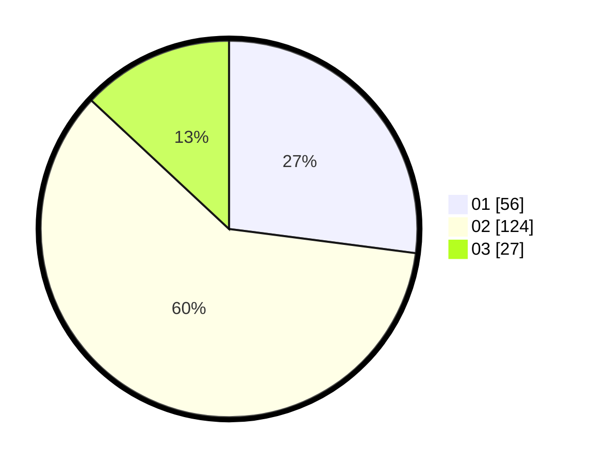

# Hasil

Hasil perolehan suara paslon dapat dilihat pada file paslon-01.txt, paslon-02.txt, dan paslon-03.txt.

Jika tidak ada, artinya data tersebut belum ada pada SIREKAP.

## Perolehan Suara

 * Paslon 01: **56**.
 * Paslon 02: **124**.
 * Paslon 03: **27**.

## Foto C Plano

https://sirekap-obj-formc.kpu.go.id/0858/pemilu/ppwp/31/73/01/10/05/3173011005236-20240214-235023--52314490-070a-4920-83cc-878b67ee01ac.jpg

https://sirekap-obj-formc.kpu.go.id/0858/pemilu/ppwp/31/73/01/10/05/3173011005236-20240214-235054--3ecffbc4-a75e-45ee-a321-8fed2c70d0a9.jpg

https://sirekap-obj-formc.kpu.go.id/0858/pemilu/ppwp/31/73/01/10/05/3173011005236-20240214-235111--b2a9eb62-526c-4c49-97fc-8f5a1261e6a2.jpg

## DATA PEMILIH TETAP

Jumlah pemilih dalam DPT: **289**.
 * L: **150**.
 * P: **139**.

## DATA PENGGUNA HAK PILIH

Jumlah pengguna hak pilih dalam DPT: **209**.
 * L: **99**.
 * P: **110**.

Jumlah pengguna hak pilih dalam DPTb: **3**.
 * L: **1**.
 * P: **2**.

Jumlah pengguna hak pilih dalam DPK: **0**.
 * L: **0**.
 * P: **0**.

Jumlah pengguna hak pilih: **212**.
 * L: **100**.
 * P: **112**.

## JUMLAH SUARA SAH DAN TIDAK SAH

JUMLAH SELURUH SUARA SAH: **207**.

JUMLAH SUARA TIDAK SAH: **5**.

JUMLAH SELURUH SUARA SAH DAN SUARA TIDAK SAH: **212**.
