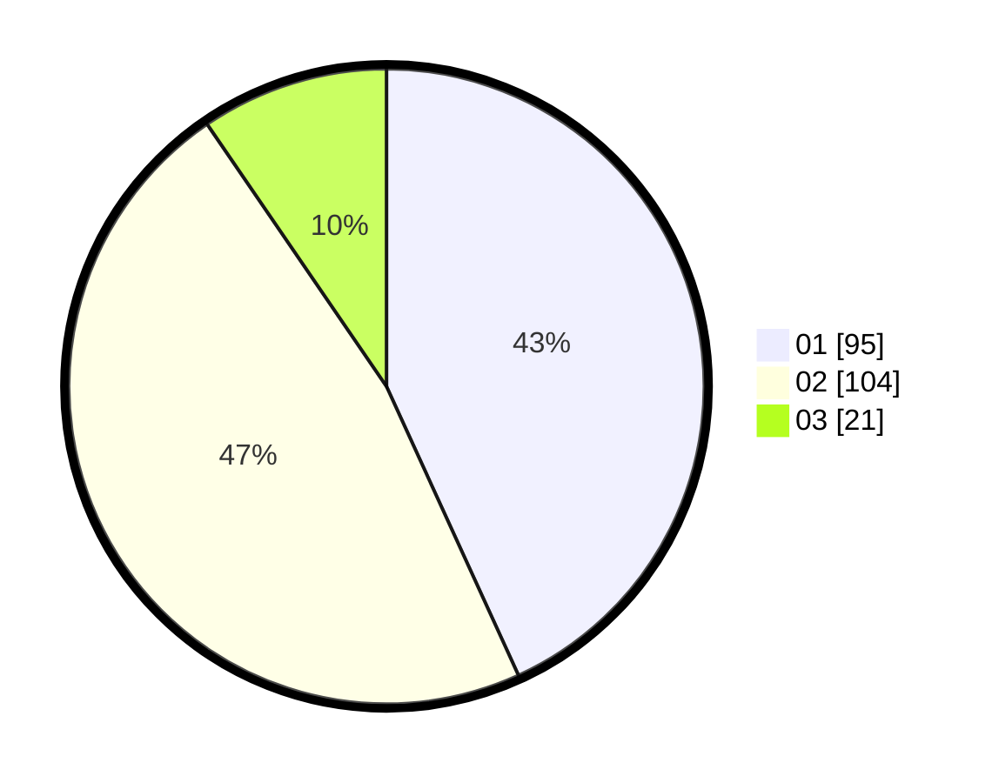

# Hasil

Hasil perolehan suara paslon dapat dilihat pada file paslon-01.txt, paslon-02.txt, dan paslon-03.txt.

Jika tidak ada, artinya data tersebut belum ada pada SIREKAP.

## Perolehan Suara

 * Paslon 01: **95**.
 * Paslon 02: **104**.
 * Paslon 03: **21**.

## Foto C Plano

https://sirekap-obj-formc.kpu.go.id/bcc0/pemilu/ppwp/31/73/01/10/05/3173011005237-20240215-001358--e6e528f7-36b8-437c-9e2f-5eb7ad0cdb74.jpg

https://sirekap-obj-formc.kpu.go.id/bcc0/pemilu/ppwp/31/73/01/10/05/3173011005237-20240215-001655--d7bbb14d-257b-4395-8b8d-dd3ff6b3fbbd.jpg
