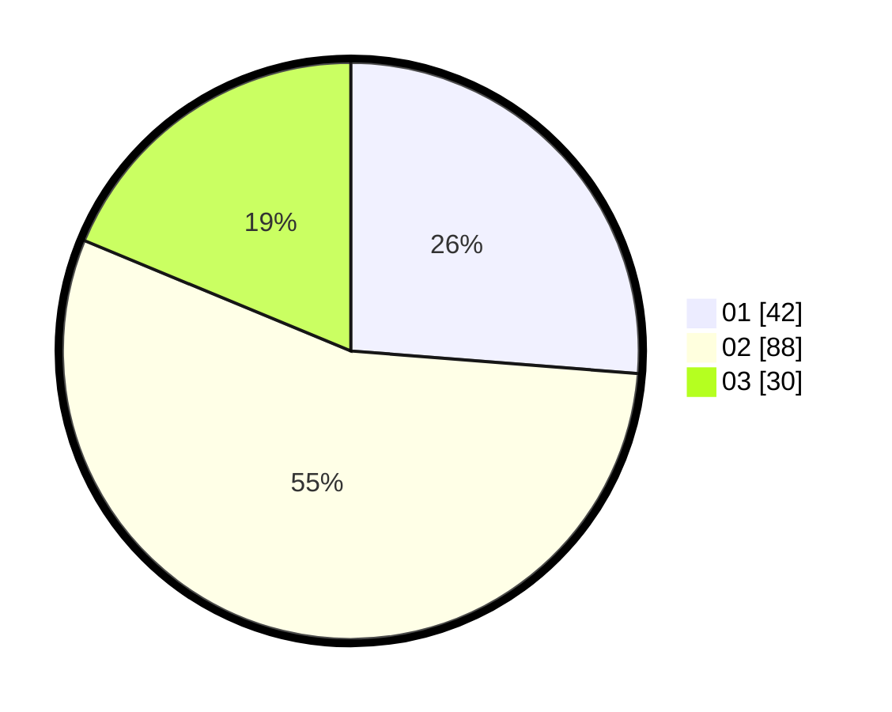

# Hasil

Hasil perolehan suara paslon dapat dilihat pada file paslon-01.txt, paslon-02.txt, dan paslon-03.txt.

Jika tidak ada, artinya data tersebut belum ada pada SIREKAP.

## Perolehan Suara

 * Paslon 01: **42**.
 * Paslon 02: **88**.
 * Paslon 03: **30**.

## Foto C Plano

https://sirekap-obj-formc.kpu.go.id/0efc/pemilu/ppwp/31/73/01/10/05/3173011005244-20240215-100352--ff52e097-e6c9-453a-9c3e-6420e12e77ba.jpg

https://sirekap-obj-formc.kpu.go.id/0efc/pemilu/ppwp/31/73/01/10/05/3173011005244-20240215-100759--859a81da-9d4c-4220-884a-92597510f0ff.jpg

https://sirekap-obj-formc.kpu.go.id/0efc/pemilu/ppwp/31/73/01/10/05/3173011005244-20240215-101024--7d69e414-dba3-47b9-a11b-1c0cf5d14a18.jpg
