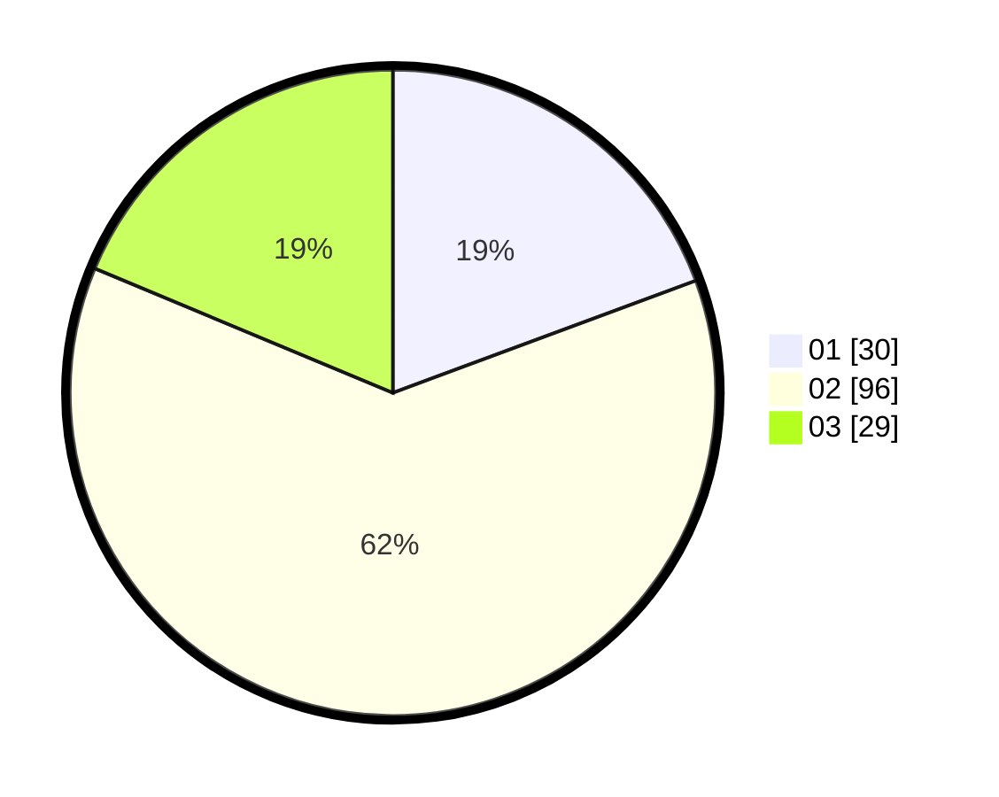

# Hasil

Hasil perolehan suara paslon dapat dilihat pada file paslon-01.txt, paslon-02.txt, dan paslon-03.txt.

Jika tidak ada, artinya data tersebut belum ada pada SIREKAP.

## Perolehan Suara

 * Paslon 01: **30**.
 * Paslon 02: **96**.
 * Paslon 03: **29**.

## Foto C Plano

https://sirekap-obj-formc.kpu.go.id/518c/pemilu/ppwp/31/73/01/10/05/3173011005245-20240215-053848--5de1ea24-e5a7-4339-84c2-5166bc65d365.jpg

https://sirekap-obj-formc.kpu.go.id/518c/pemilu/ppwp/31/73/01/10/05/3173011005245-20240215-054024--3e15144f-c737-43c2-add3-d53c6f4733f9.jpg

https://sirekap-obj-formc.kpu.go.id/518c/pemilu/ppwp/31/73/01/10/05/3173011005245-20240215-054131--9e52ecd6-869b-42cb-8457-041fae44a14b.jpg
